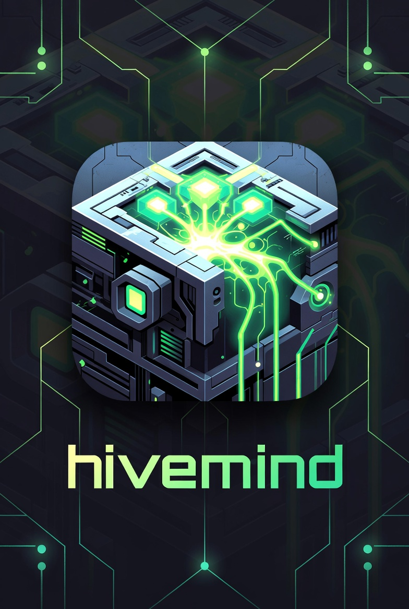

<p align="center">
  
</p>

<h1 align="center">HiveMind OS</h1>

<p align="center"><strong>A privacy-aware desktop AI agent for power users and teams.</strong></p>

<!-- Badges placeholder -->
<!--  -->
<!--  -->
<!--  -->

---

## Overview

HiveMind OS is a cross-platform desktop AI agent that acts as a persistent, intelligent operating companion. It connects to multiple model providers, orchestrates background tasks, integrates with external tools via the Model Context Protocol (MCP), maintains a private knowledge graph for long-term memory, and enforces strict data-classification boundaries so that private information never leaks over public channels.

### Key Differentiators

- **Privacy controls** — Every piece of data carries a classification label (`PUBLIC` / `INTERNAL` / `CONFIDENTIAL` / `RESTRICTED`). Outbound channels are classified too; the system blocks or redacts data that would cross a boundary.
- **Pluggable agentic loops** — Swap reasoning strategies (ReAct, Sequential, PlanThenExecute) and inject middleware without touching core logic.
- **Local model support** — Run models in-process via Candle, ONNX, or llama.cpp. No data ever leaves your machine.
- **Daemon-first architecture** — HiveMind OS runs as a background daemon; the Tauri desktop UI, CLI, and future web console are all equal clients.

---

## Features

### Multi-Provider AI

Route requests across multiple LLM backends with automatic fallback:

- **OpenAI** — GPT-4o, GPT-4o-mini, o3, o4-mini
- **Anthropic** — Claude Sonnet 4, Claude Opus 4
- **Azure OpenAI** — Org-managed Azure deployments
- **Microsoft Foundry** — Model discovery, multi-model deployments (Phi-4, Mistral, DeepSeek, Llama 4)
- **GitHub Copilot** — Code completions, chat, agent tools via GitHub OAuth
- **Ollama** — Local models (Llama 3, Mistral, DeepSeek Coder)
- **OpenRouter** — Aggregated access to 100+ models with auto-fallback
- **Embedded models** — In-process inference for zero-latency housekeeping

Model roles (`primary`, `admin`, `coding`, `scanner`) let you assign purpose-specific models — use a local model for classification and a frontier model for reasoning.

### Privacy & Security

- **Data classification** — Four-tier labelling system: Public, Internal, Confidential, Restricted
- **Channel classification** — Every outbound channel declares what data levels it accepts
- **Classification gate** — Blocks, redacts, or prompts the user before data crosses a boundary
- **Prompt injection scanning** — Isolated scanner model analyses inbound data (tool results, MCP responses, web content) before it reaches the agent
- **User consent flow** — Interactive prompts for boundary-crossing decisions with Allow / Deny / Redact options
- **Tamper-evident audit log** — Every data-flow decision is recorded with timestamp, user identity, and data hash
- **Credential vault** — API keys stored in OS keychain (macOS Keychain / Windows Credential Manager / Linux Secret Service)

### Knowledge Graph

- **SQLite property graph** — Nodes, edges, and properties stored in a single SQLite database
- **FTS5 full-text search** — Fast keyword search across all knowledge-graph content
- **sqlite-vec vector search** — Semantic similarity search with 384-dim float embeddings
- **Classification inheritance** — Nodes inherit the highest classification of their ancestors via recursive CTEs
- **Automatic memory persistence** — The agent remembers across sessions via structured, queryable memory

### MCP Integration

- **Model Context Protocol client** — Connect to any MCP-compliant server
- **Stdio & SSE transports** — Launch local MCP servers via subprocess or connect to remote servers over HTTP SSE
- **Tool/resource/prompt discovery** — Automatically discover and surface MCP server capabilities
- **Notifications API** — Receive and triage notifications from MCP servers

### Local Models

- **Multiple runtimes** — Candle (pure Rust), ONNX, llama.cpp via `llama-cpp-rs`
- **HuggingFace Hub** — Search, browse, and download models directly from the Hub
- **Hardware detection** — Automatic GPU/CPU capability detection for optimal inference
- **Memory management** — LRU eviction with configurable memory ceiling and GPU layer offloading
- **Plugin-style installation** — `hive model install`, `hive model uninstall`, `hive model status`

### Agentic Loops

- **Pluggable strategies** — ReAct (reason-act cycles), Sequential, PlanThenExecute
- **Configurable middleware** — Inject classification checks, audit logging, or custom logic into the loop pipeline
- **Tool orchestration** — Automatic tool selection and execution with result handling
- **Context management** — Conversation history, context compaction, and session isolation

### Rich Tooling

- **13+ built-in tools** — File operations, web search, code execution, and more
- **MCP tool bridge** — Tools from MCP servers appear alongside built-in tools
- **Extensible registry** — Add custom tools with approval policies and classification awareness
- **Tool approval policies** — Per-tool consent (auto-approve, prompt, deny) based on risk level

### Task Scheduling

- **Background task scheduler** — Run tasks on schedules without user interaction
- **Trigger types** — Cron expressions, fixed intervals, one-shot timers
- **Task persistence** — Scheduled tasks survive daemon restarts

---

## Architecture

HiveMind OS is structured as a 13-crate Rust workspace plus a Tauri desktop application:

```
┌─────────────────────────────────────────────────────────────────┐
│                       HiveMind OS Daemon (Rust)                        │
│                                                                  │
│  ┌────────────────┐  ┌────────────────┐  ┌────────────────┐     │
│  │  hive-core    │  │ hive-classif. │  │ hive-knowledge│     │
│  │  Config, audit │  │ Data labelling │  │ Graph + vector │     │
│  │  events, types │  │ gates, redact  │  │ search (SQLite)│     │
│  └────────────────┘  └────────────────┘  └────────────────┘     │
│                                                                  │
│  ┌────────────────┐  ┌────────────────┐  ┌────────────────┐     │
│  │  hive-model   │  │ hive-inference│  │  hive-mcp     │     │
│  │  Provider      │  │ Local model    │  │  MCP client    │     │
│  │  routing       │  │ runtimes, HF   │  │  Stdio + SSE   │     │
│  └────────────────┘  └────────────────┘  └────────────────┘     │
│                                                                  │
│  ┌────────────────┐  ┌────────────────┐  ┌────────────────┐     │
│  │  hive-loop    │  │  hive-tools   │  │  hive-api     │     │
│  │  Agentic loop  │  │  Tool registry │  │  HTTP API,     │     │
│  │  strategies    │  │  + MCP bridge  │  │  chat, schedule│     │
│  └────────────────┘  └────────────────┘  └────────────────┘     │
│                                                                  │
│  ┌────────────────┐  ┌────────────────┐  ┌────────────────┐     │
│  │  hive-daemon  │  │  hive-cli     │  │hive-test-utils│     │
│  │  Server entry  │  │  CLI commands  │  │  Test mocks    │     │
│  │  point         │  │               │  │                │     │
│  └────────────────┘  └────────────────┘  └────────────────┘     │
│                                                                  │
│  ┌──────────────────────────────────────────────────────────┐   │
│  │              Local API (HTTP/WS + Socket)                 │   │
│  └──────────────────────────────────────────────────────────┘   │
└──────┬──────────────────────────────────────────────┬───────────┘
       │                                              │
 ┌─────▼──────────┐                            ┌──────▼─────┐
 │ hivemind-desktop  │                            │    CLI     │
 │ Tauri + SolidJS│                            │            │
 └────────────────┘                            └────────────┘
```

### Crate Descriptions

| Crate | Description |
|---|---|
| **hive-core** | Shared types, configuration loading (`hivemind.yaml`), audit logger, event bus, daemon lifecycle |
| **hive-classification** | Data classification engine — labellers, classification gates, pattern detection, content redaction |
| **hive-knowledge** | SQLite property-graph knowledge store with FTS5 full-text and sqlite-vec vector search |
| **hive-model** | Model routing, provider adapters (OpenAI, Anthropic, Azure, Ollama, etc.), capability management |
| **hive-inference** | Local model inference runtimes (Candle, ONNX, llama.cpp), HuggingFace Hub integration, hardware detection |
| **hive-mcp** | Model Context Protocol client — server connections (Stdio/SSE), tool/resource discovery, notifications |
| **hive-loop** | Agentic loop engine — reasoning strategies, middleware pipeline, tool orchestration, context management |
| **hive-tools** | Tool registry, built-in tool implementations, MCP tool bridge, approval policies |
| **hive-api** | HTTP API server — chat sessions, risk scanning, model management, task scheduling, MCP control |
| **hive-daemon** | Production daemon binary — starts the Axum HTTP server, initializes logging and lifecycle management |
| **hive-cli** | CLI binary — daemon start/stop/status, configuration commands |
| **hive-test-utils** | Testing utilities — mock providers, test infrastructure for integration tests |
| **hivemind-desktop** | Tauri v2 + SolidJS desktop application — thin webview shell connecting to the daemon API |

---

## Prerequisites

| Tool | Version | Purpose |
|------|---------|---------|
| [Rust](https://rustup.rs) | 1.85+ | All `hive-*` crates |
| [Node.js](https://nodejs.org) | 18+ | Frontend build |
| npm or pnpm | Latest | Frontend package manager |
| [Tauri CLI](https://v2.tauri.app) | v2 | Desktop app build (`cargo install tauri-cli --version "^2"`) |

### Platform-Specific

- **Windows:** WebView2 (bundled with Windows 10+), Visual Studio Build Tools (C++ workload)
- **macOS:** Xcode Command Line Tools (`xcode-select --install`)
- **Linux:** WebKit2GTK development libraries

---

## Quick Start

### Build the workspace

```bash
# Build all Rust crates
cargo build --workspace

# Run all tests
cargo test --workspace

# Lint
cargo clippy --workspace
```

### Build the desktop app

```bash
cd apps/hivemind-desktop
npm install
npm run build
```

### Development mode (hot-reload)

```bash
# Start the Tauri dev server with hot-reload
cargo tauri dev
```

### Run the daemon directly

```bash
cargo run -p hive-daemon
```

### Run the CLI

```bash
cargo run -p hive-cli -- --help
```

---

## Configuration

HiveMind OS is configured via a `hivemind.yaml` file. Key sections:

```yaml
# Model providers
providers:
  - id: openai
    type: openai-compatible
    base_url: https://api.openai.com/v1
    auth: env:OPENAI_API_KEY
    models: [gpt-4o, gpt-4o-mini]
    channel_class: public

  - id: ollama-local
    type: openai-compatible
    base_url: http://localhost:11434/v1
    auth: none
    models: [llama3, mistral]
    channel_class: private

# Model roles
model_roles:
  primary:
    provider: openai
    model: gpt-4o
  admin:
    provider: ollama-local
    model: llama3

# Security
security:
  override_policy:
    RESTRICTED:
      action: block
    CONFIDENTIAL:
      action: prompt
```

---

## License

MIT — see [Cargo.toml](./Cargo.toml) workspace configuration.
