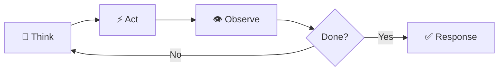

# Agentic Loops

An agentic loop is how your AI agent thinks. It's the cycle of reasoning, acting, and learning that turns a simple prompt into a completed task.

When you ask HiveMind OS to do something — research a topic, refactor a module, debug a test — the agent doesn't just fire off a single LLM call. It enters a **loop**: think about the problem, take an action (call a tool, query memory, ask you a question), observe the result, and repeat until the job is done.

## The Core Cycle

Every agentic loop follows the same fundamental pattern:

**Think** — The model reasons about the current state. What's been done? What's left? What tool should I use next?

**Act** — The agent executes an action: calling a tool, querying the knowledge graph, or generating output.

**Observe** — The result comes back. The agent incorporates it into context and decides what to do next.

This cycle repeats until the task is complete or the agent has a final answer.

## Built-in Strategies

HiveMind OS doesn't lock you into one reasoning style. The agentic loop is **pluggable** — you choose the strategy that fits the task.

### `react` (Default)

Reason → Act → Observe. The classic tool-using agent loop. The model thinks about what to do, takes one action, sees the result, and repeats. Simple, effective, and works for the vast majority of tasks.

### `sequential`

Execute a predefined sequence of steps in order. Each step completes before the next begins. Useful for straightforward, linear tasks where the steps are known upfront.

### `plan_then_execute`

Create a full plan first, then execute each step methodically. The agent generates a numbered list of steps, then works through them one by one, each with its own tool-call budget. Better for complex, multi-step tasks where you want structure.

## When to Use Which

| Strategy | Best For | Example |
|---|---|---|
| **`react`** | Quick tasks, Q&A, tool use | "What does this function do?" |
| **`sequential`** | Linear, known-steps tasks | "Run these three checks in order" |
| **`plan_then_execute`** | Multi-step projects | "Refactor this module into three services" |

::: tip Start with react
`react` is the default for a reason — it handles 90% of tasks well. Only switch strategies when you have a specific reason to. `plan_then_execute` shines for big, complex projects; `sequential` for well-defined linear workflows.
:::

## Context Compaction

Long-running agent sessions can outgrow the model's context window. Rather than silently dropping early turns, HiveMind OS uses **compaction** — summarising older turns into a concise prose summary and pruning the raw turns from context.

Compaction triggers automatically when token usage exceeds a threshold. The agent keeps working seamlessly — with a summary of earlier context and recent turns still in full detail.

## Middleware Pipeline

The agentic loop isn't just a strategy — it's a **pipeline with hooks**. Middleware plugins run before and after every model call and tool call:

| Hook | Runs When | Example Use |
|------|-----------|-------------|
| `beforeModelCall` | Before each LLM request | Inject knowledge graph context, enforce token budgets |
| `afterModelResponse` | After each LLM response | Log token usage, track costs |
| `beforeToolCall` | Before each tool execution | Check data classification, enforce permissions |
| `afterToolResult` | After each tool result | Scan for prompt injection, audit logging |

You configure the middleware stack in your loop config — stack them in any order, and each one can modify or block the request passing through.

## See It in Action

Imagine you ask: *"Research the top 5 competitors in the AI code assistant space and write a comparison report."*

With **`plan_then_execute`**, the agent:

1. **Plans** — Breaks the task into steps: identify competitors, research each one, compare features, write report
2. **Executes step 1** — Uses web search tools to identify the top 5 competitors
3. **Executes step 2** — Researches each competitor (features, pricing, reviews)
4. **Executes step 3** — Compares across dimensions (features, price, developer experience)
5. **Executes step 4** — Synthesizes everything into a structured comparison report

Each step gets its own tool-call budget. The agent stays on track because the plan provides structure. And if context gets long, compaction kicks in — summarising earlier turns so nothing is lost.

## Learn More

- [Agentic Loops Guide](/guides/agentic-loops) — Hands-on configuration and custom strategy authoring
- [How It Works](./how-it-works) — The big picture of HiveMind OS architecture
- [Knowledge Graph](./knowledge-graph) — How memory powers long-running agent sessions
