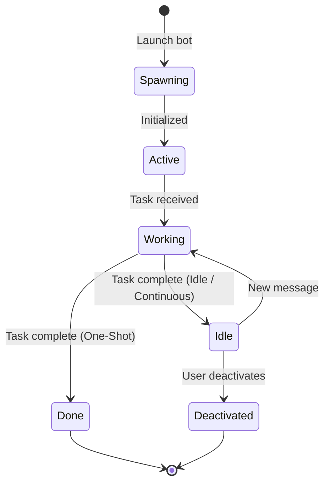

# Bots

A bot is a persistent AI agent instance — it has a name, a persona, and a mission. Unlike a chat conversation, a bot lives on.

Where a regular chat session ends when you close the window, a bot keeps running in the background. It can complete tasks autonomously, monitor events, respond to triggers, and wait for your next instruction — all without an active conversation.

## What Is a Bot?

A bot is an **always-on agent** powered by a [persona](./personas). When you launch a bot, HiveMind OS creates a dedicated agent process backed by the persona's system prompt, tools, and permissions. The bot receives a **launch prompt** — its initial mission — and begins working independently.

Every bot has:

- **A name** — a friendly identifier shown across the UI (`friendly_name`)
- **A persona** — the skill set, system prompt, and tool access that define its capabilities
- **A mode** — how it behaves after completing its initial task
- **A data classification** — what sensitivity level of data it can access

## Bots vs Regular Chat

| | Regular Chat | Bot |
|---|---|---|
| **Persistence** | Session-based — ends when you close it | Always available — survives app restarts |
| **Identity** | Ad-hoc, no saved configuration | Named, configured, reusable |
| **Autonomy** | User-driven turn-by-turn | Can run independently in the background |
| **Mode** | Interactive only | One-shot, Idle, or Continuous |

::: tip When to use a bot vs regular chat
Use **regular chat** for quick questions, brainstorming, or one-off explorations. Use a **bot** when you need an agent that persists beyond a single session — monitoring systems, handling recurring tasks, or standing by as a specialist team member you can message anytime.
:::

## Bot Modes

Every bot runs in one of three modes that control its lifecycle after the launch prompt completes:

### One-Shot

Fire-and-forget. The bot receives its launch prompt, completes the task, and terminates. Use this for bounded work where you don't need follow-up.

> *Example:* "Analyze this codebase and write an architecture summary."

One-shot bots support an optional **timeout** (`timeout_secs`) — if the task isn't finished by then, the bot stops automatically.

### Idle After Task

The default mode. The bot completes its launch prompt, then **waits for new messages**. Think of it as a team member who finishes an assignment and says "what's next?"

> *Example:* "Review this PR for security issues" → bot finishes → you send "now check the test coverage."

The bot stays alive indefinitely (or until an optional idle timeout expires), ready for follow-up work.

### Continuous

An always-on daemon. The bot treats its launch prompt as **standing orders** and runs indefinitely — monitoring events, responding to triggers, and never stopping unless you deactivate it.

> *Example:* "Monitor deployment events and alert me on failures."

## Bot Lifecycle

## Launching a Bot

To launch a bot in HiveMind OS:

1. **Pick a persona** — select the skill set and system prompt that match the job
2. **Set a launch prompt** — the initial task or standing orders
3. **Choose a mode** — One-Shot, Idle After Task, or Continuous
4. **Configure permissions** — data classification, tool overrides, and approval rules
5. **Launch** — the bot spins up and begins working immediately

## Bot Configuration

Each bot carries its own configuration independent of any chat session:

| Setting | Purpose |
|---|---|
| **Data classification** | Controls what sensitivity level the bot can access (Public, Internal, Confidential, Restricted) |
| **Tool overrides** | Restrict or expand the tools available beyond the persona defaults (`allowed_tools`) |
| **Permission rules** | Per-bot tool approval policies — require human approval for dangerous operations |
| **Timeout** | Maximum execution time for one-shot bots; idle timeout for persistent bots |
| **Model** | Override the default model or set a preferred model fallback list |

## The Bots Dashboard

The **Bots** page in HiveMind OS is your command center for managing all active and inactive bots:

- **Live status** — see which bots are Active, Waiting, Paused, or in Error at a glance
- **Activity log** — review what each bot has been doing, including tool calls and outputs
- **Messaging interface** — send follow-up messages to idle bots directly from the dashboard
- **Approval badges** — bots waiting for human approval surface clearly so you never miss a gate
- **Question badges** — bots that have asked a question and are waiting for your response are flagged with a question badge

## Agent Stage

For multi-agent scenarios, the **Agent Stage** provides a visual collaboration view. When multiple bots work together — say, a planner bot delegating to a coder bot and a reviewer bot — the Stage shows each agent's status, message flow, and progress in real time. It's the visual layer on top of the supervisor system that orchestrates agent teams.

Badges on each agent card give you at-a-glance status:

- **Question badge** — the bot has asked a question and is waiting for your response. Click the badge to view and answer.

- **Approval badge** — the bot needs human approval before it can proceed with a tool call. See the [Security Policies Guide](/guides/security-policies) for how approval rules work.

## Putting It Together

Here's a real-world example combining everything:

> Launch a **Continuous** bot using your **DevOps** persona that monitors deployment events and alerts you on failures. Give it access to your infrastructure tools, set its data classification to **Internal**, and require approval before it runs any remediation commands.

The bot starts, begins watching for events, and runs 24/7 in the background. When a deploy fails, it sends you an alert. If it determines a fix is available, it queues the action and waits for your approval before proceeding.

## Learn More

- [Bots Guide](/guides/bots) — Step-by-step walkthrough for creating and managing bots
- [Personas](./personas) — How personas define a bot's capabilities
- [Privacy & Security](./privacy-and-security) — Data classification and access controls
