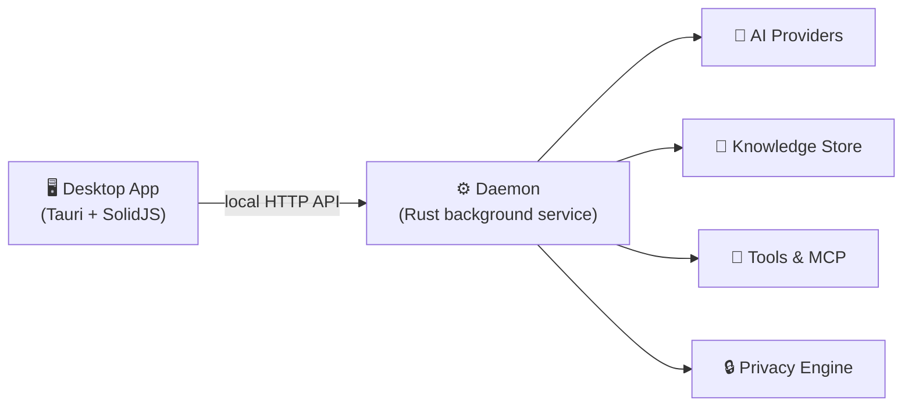
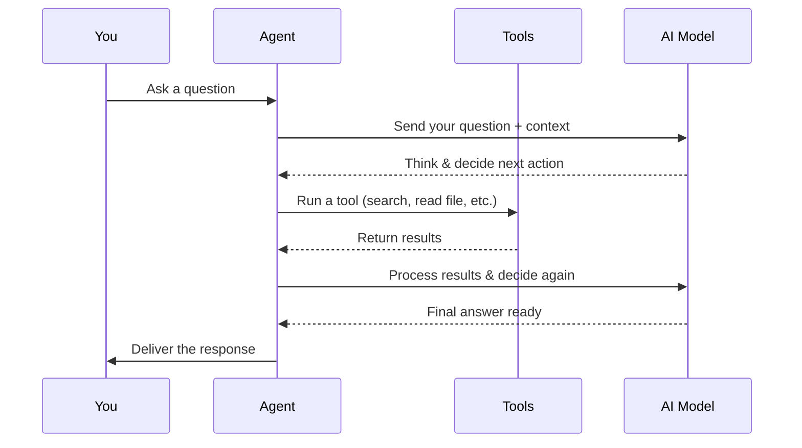

# How It Works

HiveMind OS is a privacy-first AI agent that runs entirely on your machine.

Unlike cloud-based AI assistants, HiveMind OS keeps your data, conversations, and memory local. You stay in control of what (if anything) leaves your computer.

## The Big Picture

HiveMind OS has two main parts: a **daemon** (the engine) and a **desktop app** (the dashboard).

The **daemon** is a lightweight Rust service that runs in your system tray. It does all the heavy lifting — talking to AI models, running tools, storing your knowledge graph, and enforcing privacy rules.

The **desktop app** is just a window into the daemon. It sends requests over a local API that never touches the internet. You can close the app and the daemon keeps working on background tasks.

::: info Why does this matter?
Because the daemon runs independently, your scheduled tasks, background agents, and memory all persist — even when the app window is closed. And because communication is local-only, no data leaks out through the UI layer.
:::

## The Agent Loop

When you ask HiveMind OS a question, here's what happens behind the scenes:

The agent can loop through the **think → act → observe** cycle multiple times, gathering information and refining its answer before responding. Different strategies (like ReAct or Plan-then-Execute) control how the agent approaches complex tasks.

## Where Your Data Lives

Everything stays on your machine by default:

| What | Where |
|------|-------|
| Conversations & memory | SQLite databases in your local data folder |
| Knowledge graph | SQLite with full-text and vector search |
| Configuration | `~/.hivemind/config.yaml` (global), `.hivemind/config.yaml` (project override) |
| API keys & credentials | Your OS keychain (macOS Keychain, Windows Credential Manager, etc.) — never stored as plain text |

When you do connect to cloud AI providers (like OpenAI or Anthropic), HiveMind OS's **classification system** controls exactly what data is allowed to leave your machine. Every piece of data is labelled — Public, Internal, Confidential, or Restricted — and the system blocks or redacts anything that would cross a privacy boundary.

## System Tray

The daemon lives in your system tray (menu bar on macOS). From the tray icon you can:

- See at a glance whether the daemon is **running** or **stopped**
- Jump straight into your latest **conversations**
- Open **settings** or manage **bots**
- Start or stop the daemon without opening the full app

## Learn More

- [Privacy & Security](./privacy-and-security) — How the classification system protects your data
- [Agentic Loops](./agentic-loops) — Deep dive into reasoning strategies
- [Tools & MCP](./tools-and-mcp) — How the agent interacts with external tools
- [Knowledge Graph](./knowledge-graph) — How long-term memory works
- [Providers & Models](./providers-and-models) — Connecting to AI backends
- [Bots](./bots) — Creating custom agents with personas and skills
