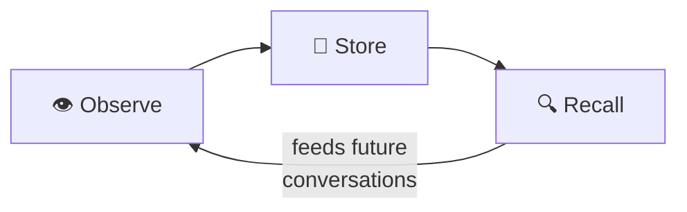

# Knowledge Graph

HiveMind OS doesn't just answer questions — it remembers. Every conversation builds a private knowledge graph that makes future interactions smarter.

Think of it as the agent's long-term memory — a **local property graph database** of entities, facts, relationships, and preferences that grows with every interaction. Fully searchable. Completely private.

## How Memory Works

Memory flows through three phases: **observe**, **store**, and **recall**.

### Observe

During every conversation, HiveMind OS quietly extracts useful information — people you mention, decisions you make, technologies you discuss, preferences you express. You don't need to do anything special.

### Store

Extracted knowledge goes into a **local SQLite property graph** — nodes and edges with rich properties. Two search layers make recall fast:

- **FTS5 full-text indexing** — keyword search across node names, descriptions, and observations
- **sqlite-vec vector embeddings** — semantic similarity search powered by a local embedding model (data never leaves your machine)

### Recall

When you ask a question, the agent searches using three strategies:

1. **Keyword search** — fast full-text matching via FTS5
2. **Semantic similarity** — vector-based nearest-neighbour search for fuzzy, meaning-based recall
3. **Graph traversal** — follow relationships to find connected context

HiveMind OS combines all three automatically, re-ranking by relevance, recency, and confidence.

## What It Remembers

The knowledge graph uses a flexible schema of generic **Nodes** and **Edges** with string-typed labels. Rather than a fixed taxonomy, each node has a type field (a free-form string like `"person"`, `"project"`, `"preference"`, `"fact"`) and rich properties — name, description, observations, and metadata. Edges likewise have a string type (e.g. `"related_to"`, `"uses"`, `"works_on"`) connecting any two nodes.

This generic structure means the graph can represent any kind of knowledge — people, projects, decisions, preferences, technologies, events — without a rigid predefined schema. Relationships connect nodes to form a traversable web of everything the agent knows.

## How to Interact With It

::: tip Interacting with memory
- **Teach the agent** — Just ask it to remember something in natural language: *"Remember that I prefer React with TypeScript and Tailwind"*
- **Browse your memory** — Use the **Knowledge Explorer** in the UI to search and visualise your knowledge graph
:::

You can ask the agent to remember anything on the spot — preferences, decisions, facts, procedures. And the Knowledge Explorer lets you browse and search your knowledge graph directly from the UI.

But most of the time, you won't need to do either. **Memory is automatic.** The agent extracts and stores knowledge from every conversation. Over time, it builds an increasingly detailed picture of your projects, preferences, and working patterns.

## Classification and Privacy

Knowledge inherits the same [classification levels](./privacy-and-security) as everything else in HiveMind OS. Every node carries a data class — PUBLIC, INTERNAL, CONFIDENTIAL, or RESTRICTED.

Here's the critical rule: **a node inherits the highest classification of its ancestors.** If a CONFIDENTIAL entity links to a PUBLIC observation, that observation's effective class becomes CONFIDENTIAL.

RESTRICTED knowledge — private keys, secrets, sensitive details — **will never be included in prompts sent to PUBLIC providers.** Classification is enforced at the query engine level, not as an afterthought.

## See It in Action

Here's the magic moment: after a few conversations about your project — discussing architecture, picking a database, debating frontend frameworks — try asking:

> "What tech stack did we decide on?"

Watch HiveMind OS recall the exact discussions, surface the decisions you made, and present a coherent answer drawn from multiple conversations. No bookmarks, no notes, no manual saving. It just *knows* — because it was paying attention the whole time.

## Learn More

- [Knowledge Management Guide](../guides/knowledge-management) — Hands-on tips for teaching your agent and managing memory
- [Privacy & Security](./privacy-and-security) — How classification protects your knowledge
- [Personas](./personas) — How different agent roles access and contribute to the knowledge graph
