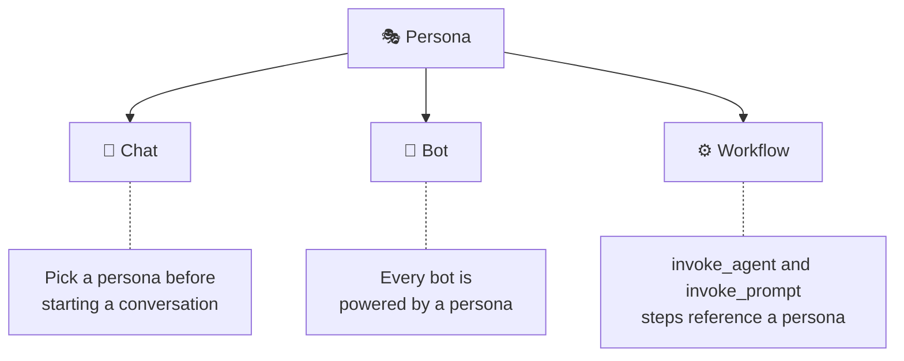

# Personas

A persona is a reusable identity for your AI agent — combining personality, capabilities, and constraints into a single package.

Think of it as a **personality + toolbox**. Instead of configuring the same system prompt, model, and tool permissions every time you start a conversation, you bundle them into a persona and reuse it everywhere — in chat, in bots, and in automated workflows.

## What's Inside a Persona?

Every persona is a configuration object with these building blocks:

| Property | What it controls |
|----------|-----------------|
| **Name, description, avatar, color** | Identity — how the persona appears in the UI |
| **System prompt** | The core instructions that shape the agent's personality and behaviour |
| **Preferred models** | Which AI models to use (primary + fallback list, supports glob patterns like `claude-*`) |
| **Secondary models** | Lighter models used for background tasks like context-map generation and compaction |
| **Allowed tools** | Scoped tool access — restrict exactly what the agent can do. Use `*` for full access or list specific tools |
| **MCP servers** | Which external integrations (databases, APIs, services) this persona can connect to |
| **Loop strategy** | How the agent reasons — `react` (think → act → observe), `sequential`, or `plan_then_execute` |
| **Context map strategy** | How workspace context is gathered — `general`, `code`, or `advanced` (LLM-powered semantic analysis) |
| **Prompt templates** | Reusable [Handlebars prompt snippets](/reference/prompt-templates) with optional input schemas, invokable from chat or workflows |

::: tip Why this matters
Personas turn one-off configuration into **reusable, shareable agent profiles**. A "Code Reviewer" persona always reviews for security issues. A "Technical Writer" persona always outputs clean Markdown. You configure once and use everywhere — no drift, no forgotten instructions.
:::

## Built-in vs Custom Personas

HiveMind OS uses a **namespace convention** to separate system and user personas:

- **`system/`** — Built-in personas that ship with the app (e.g. `system/general`). These are bundled into the binary, cannot be deleted, but can be customised or archived.
- **`user/`** — Personas you create (e.g. `user/code-reviewer`, `user/team/ops/monitor`). Full control — edit, archive, or delete at any time.

The default persona, `system/general`, is a general-purpose agent with access to all tools (`*`) and the ReAct loop strategy. It's the blank canvas you start with.

## How Personas Connect to Everything

Personas are the common thread across the three main ways you interact with HiveMind OS:



- **Regular chat** — Select a persona from the sidebar before (or during) a conversation. The agent adopts that persona's prompt, tools, and model preferences for the entire session.
- **Bots** — Every bot wraps a persona with additional triggers and schedules. The persona defines *what* the bot can do; the bot defines *when* it does it.
- **Workflows** — The `invoke_agent` and `invoke_prompt` steps accept a persona ID, so automated pipelines can call different specialist agents at each stage.

## Skills

Skills are portable knowledge packs that add domain expertise, procedures, and reference material to a persona. Skills are **managed per-persona through the UI** (not as a field in the persona configuration). From the persona editor:

- Click **Manage Skills** to browse, install, enable, or disable skills for that persona
- Skills are scoped — a "Kubernetes" skill installed on your DevOps persona won't clutter your Technical Writer persona
- Skills inherit [data classification](/concepts/privacy-and-security) — a skill marked `CONFIDENTIAL` elevates the persona's effective classification level

## Creating and Managing Personas

Open **Settings → Personas** to manage your collection:

1. **Create from scratch** — Click *New Persona*, fill in the fields, and save. Your persona appears under the `user/` namespace.
2. **Start from a template** — Use an existing persona as a starting point and customise from there.
3. **Archive / Restore** — Don't need a persona right now? Archive it to hide it from listings. It stays resolvable so existing bots and workflows that reference it keep working. Restore it any time.
4. **Edit built-ins** — Customise any `system/` persona. You can always reset it back to factory defaults later.

## Example: A Security-Focused Code Reviewer

Say you want an agent that *only* reviews code and always checks for security issues. Here's what that persona looks like:

```yaml
id: user/code-reviewer
name: Code Reviewer
description: Security-focused code review specialist
systemPrompt: |
  You are a meticulous code reviewer focused on security.
  Always check for: SQL injection, XSS, auth bypasses, secrets in code.
  Be constructive but thorough.
preferredModels:
  primary: claude-sonnet
allowedTools:
  - filesystem.read
  - filesystem.search
  - web.search
loopStrategy: plan_then_execute
```

Notice what's **not** in the allowed tools list — `filesystem.write`, `shell.execute`. This persona can read and search, but it can never modify your codebase. That's the power of scoped tool access: you get a specialist agent that is **capable but contained**.

You could then:
- Start a chat with this persona to review a PR interactively
- Wire it into a bot that triggers on new pull requests
- Call it from a workflow step after your CI build passes

## Learn More

- [Agentic Loops](./agentic-loops) — Deep dive into ReAct, Sequential, and Plan-then-Execute (`plan_then_execute`) strategies
- [Bots](./bots) — How bots wrap personas with triggers and schedules
- [Workflows](./workflows) — Automating multi-step pipelines that invoke personas
- [Tools & MCP](./tools-and-mcp) — How tool access and MCP servers work
