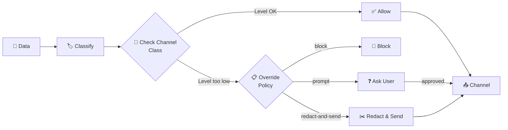

# Privacy & Security

HiveMind OS treats your data like a first-class citizen. Every piece of information gets a classification level, and the system enforces where it can — and can't — travel.

Most AI tools punt on privacy with a disclaimer. HiveMind OS makes it structural. Think of it as a **passport system for your data** — every piece of content gets stamped at the border, and the system checks that stamp before letting it through to any destination.

## Classification Levels

Every piece of data flowing through HiveMind OS carries a label:

| Level | Tag | Think of it as… |
|-------|-----|-----------------|
| 🟢 | **PUBLIC** | Stuff you'd tweet. Can go anywhere. |
| 🔵 | **INTERNAL** | Stuff you'd share at work. Stays within org-managed providers. |
| 🟡 | **CONFIDENTIAL** | Stuff you'd share with your team lead. Only goes to private, high-trust channels. |
| 🔴 | **RESTRICTED** | Stuff you'd lock in a safe. Never leaves your machine. |

Data gets classified automatically — regex patterns catch API keys, GitHub tokens, private keys, and email addresses at ingestion. Source-based rules apply too (anything from `~/.ssh/` is automatically 🔴 RESTRICTED). You can also tag content manually.

## Workspace Files and Manual Overrides

In the **Workspace** panel, you can right-click any file or folder and set its classification override to `PUBLIC`, `INTERNAL`, `CONFIDENTIAL`, or `RESTRICTED`. If you change your mind later, use **Clear Override** to fall back to automatic/source-based classification.

That label is not just cosmetic. When an agent reads that file, the classification travels with the content through the rest of the system — memory extraction, tool calls, MCP requests, messaging connectors, and other outbound actions all respect the file's effective classification. If a tool would send that content to a lower-trust channel, HiveMind OS will block it, prompt you, or redact it based on your override policy.

## Channel Classification

Every outbound channel — an MCP server, a messaging connector, a peer connection — has its own classification level:

| Channel Class | Accepts |
|---------------|---------|
| `public` | 🟢 PUBLIC only |
| `internal` | 🟢 PUBLIC + 🔵 INTERNAL |
| `private` | 🟢 PUBLIC + 🔵 INTERNAL + 🟡 CONFIDENTIAL |
| `local-only` | All levels |

The rule is simple: **data can only flow to channels at the same trust level or higher.** A 🟡 CONFIDENTIAL snippet will never reach a `public` channel unless you explicitly approve it.



## Override Policies

When data tries to cross a classification boundary, HiveMind OS doesn't just crash — it follows your policy:

| Action | What happens |
|--------|-------------|
| **`block`** | Hard stop. The data doesn't go. The agent gets a "classification denied" error and can rephrase or pick a different channel. |
| **`prompt`** | You see exactly what would cross the boundary, why it's classified that way, and where it's going. You choose whether to allow, deny, or redact. |
| **`allow`** | Let it through — useful in development, not recommended for production. |
| **`redact-and-send`** | Automatically strip the sensitive tokens, replace them with `[REDACTED]`, and send the sanitised version. Review the redaction in the audit log. |

You configure this per classification level. A sensible default: `prompt` for INTERNAL and CONFIDENTIAL, `block` for RESTRICTED.

::: danger What happens if you try to send RESTRICTED data to a PUBLIC channel?
It gets **blocked**. Period. Credentials, secrets, and private keys should never leave your machine.
:::

## Prompt Injection Defence

External data — tool results, MCP responses, web content — can carry hidden adversarial instructions designed to trick your agent. HiveMind OS fights back with an **isolated scanner model**.

The scanner is a dedicated LLM instance that runs in its own context with **no access** to the agent's conversation, tools, or state. It analyses every incoming payload before the agentic loop ever sees it.

::: tip Why a separate model?
If the scanner shared the agent's context, a clever injection could trick the model into ignoring its own detection. By isolating the scanner — no tools, no history, no state — even a payload containing "ignore all previous instructions" has no effect. The scanner can classify threats but can never act on them.
:::

When the scanner detects a threat, it returns a verdict with confidence score, threat type, and flagged spans. Depending on your config, the system can `block`, `prompt`, `flag`, or `allow` — and every scan is recorded in the risk ledger.

## MCP Server Sandboxing

MCP servers running as local processes are executed inside an **OS-level sandbox** (Seatbelt on macOS, Landlock on Linux, restricted tokens + Job Objects on Windows). The sandbox restricts filesystem access and denies sensitive directories like `~/.ssh` and `~/.aws` by default. See [Tools & MCP](./tools-and-mcp#os-level-sandboxing) for details.

## Credential Vault

API keys and secrets are preferably stored in your **OS keychain** — macOS Keychain, Windows Credential Manager, or Linux Secret Service. Environment-variable-based authentication is also supported for providers that require it.

## Audit Log

Every data-flow decision is recorded in a tamper-evident local log:

- What data was sent, blocked, or redacted
- Which classification rule triggered
- What the user decided (if prompted)
- Every security scan verdict and action taken
- All inter-agent messages with sender, recipient, and classification

The log is searchable, exportable, and available from the dashboard. If your org needs compliance reporting, it's all there.

## Putting It Together

Here's a real-world example — block API keys and passwords from ever reaching external channels:

```yaml
security:
  override_policy:
    RESTRICTED:
      action: Block          # Secrets never leave your machine
    CONFIDENTIAL:
      action: Prompt         # Ask before sending sensitive data
    INTERNAL:
      action: Allow          # Org-internal data can flow to org channels

  prompt_injection:
    enabled: true
    model_role: scanner      # Isolated scanner model
    action_on_detection: Prompt
    confidence_threshold: 0.7
```

With this config, any data containing detected secrets (API keys, tokens, passwords) is automatically classified 🔴 RESTRICTED and **hard-blocked** from all outbound channels. Sensitive project data gets a user prompt. And every incoming payload is scanned for injection attempts before the agent sees it.

Your data has a passport. HiveMind OS checks it at every border.

## Learn More

- [Security Policies Guide](../guides/security-policies) — Hands-on configuration for classification rules and override policies
- [How It Works](./how-it-works) — Architecture overview
- [Tools & MCP](./tools-and-mcp) — How external tools are sandboxed and classified
