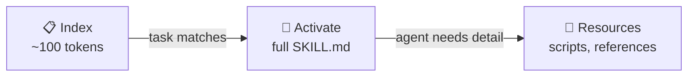
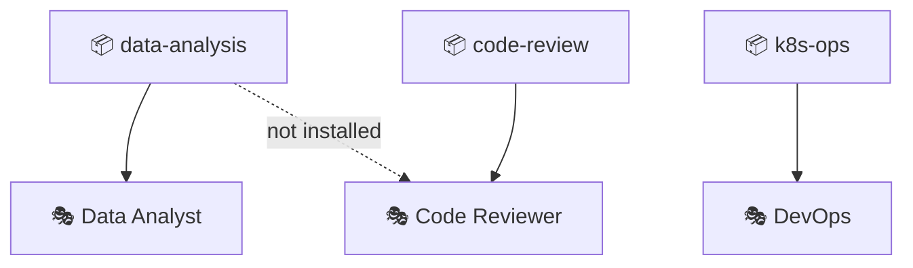

# Agent Skills

Agent Skills are portable knowledge packs that teach your agent *how* to do things — procedures, domain expertise, scripted workflows, and reference material, all bundled into a simple directory.

::: info Skills vs Tools
**Tools** (including [MCP](/concepts/tools-and-mcp)) give the agent *actions* it can call — read a file, query a database, search the web. **Skills** give the agent *knowledge and procedures* — how to approach a task, what conventions to follow, and what scripts to run. They complement each other: a skill might instruct the agent to call specific tools in a specific order.
:::

## The Open Standard

HiveMind OS implements the open **[Agent Skills](https://agentskills.io)** standard — a vendor-neutral specification for packaging agent knowledge as portable, file-based skill directories.

The full specification is available at **[agentskills.io/specification](https://agentskills.io/specification)**.

Any agent or platform that supports the Agent Skills standard can use the same skill packages. Write once, use everywhere — whether in HiveMind OS, another agent framework, or your own tooling.

## How Skills Work

Skills follow a **progressive disclosure** pattern that keeps agent context lean:



1. **Startup** — HiveMind OS scans configured skill sources and loads each skill's `name` and `description` (~100 tokens each) into a lightweight index.
2. **Activation** — When a task matches a skill's description (by keyword, semantic similarity, or explicit request), the full `SKILL.md` body is injected into the agent's context.
3. **Resources on demand** — Files in `scripts/`, `references/`, and `assets/` are loaded only when the agent needs them, keeping context focused.

## Anatomy of a Skill

Every skill is a directory with a `SKILL.md` file at its root:

```
my-skill/
├── SKILL.md            # Required — metadata + instructions
├── scripts/            # Optional — executable code
│   └── generate.py
├── references/         # Optional — detailed documentation
│   └── REFERENCE.md
└── assets/             # Optional — templates, data files
    └── template.docx
```

The `SKILL.md` file has two parts — **YAML frontmatter** (the manifest) and a **Markdown body** (the instructions):

```markdown
---
name: data-analysis
description: Analyse CSV datasets, generate charts, and produce summary reports
license: MIT
compatibility: ">=1.0"
metadata:
  author: Your Name
  category: analytics
allowed-tools: "filesystem.* shell.*"
---

## Instructions

1. Load the dataset using `scripts/load_data.py`
2. Generate visualisations following the style guide in `references/CHARTS.md`
3. Write a summary report with key findings
```

### Manifest Fields

| Field | Required | Description |
|---|---|---|
| `name` | ✅ | Unique identifier (lowercase, hyphens only, max 64 chars) |
| `description` | ✅ | What the skill does and when to use it (max 1024 chars) |
| `license` | — | License name or reference |
| `compatibility` | — | Environment requirements (max 500 chars) |
| `metadata` | — | Arbitrary key-value pairs for extra context |
| `allowed-tools` | — | Space-separated tool patterns pre-approved for this skill |

See the full [field specification](https://agentskills.io/specification) for validation rules and constraints.

## Skills + Personas

Skills are **scoped to personas**. Each persona can have a different set of skills installed, so your Code Reviewer persona doesn't get cluttered with your Data Analyst's skills.

From the **Persona Editor**:
- Click **Manage Skills** to browse, install, enable, or disable skills
- Skills inherit [data classification](/concepts/privacy-and-security) rules — a skill that accesses external APIs should be used in appropriately classified sessions



## Sourcing Skills

Skills can come from multiple sources:

| Source | How |
|---|---|
| **Bundled** | Built into HiveMind OS (e.g. CadQuery modelling, web research) |
| **GitHub repos** | Add a skill repository as a source in your config |
| **Local directories** | Point to a skill directory on your machine |

```yaml
# ~/.hivemind/config.yaml
skills:
  enabled: true
  sources:
    - type: github
      url: https://github.com/your-org/agent-skills
  storage_path: ~/.hivemind/skills-cache
```

## Writing Good Skills

The Agent Skills spec recommends these best practices:

- **Keep `SKILL.md` under 500 lines** — move detailed reference material to `references/`
- **Write clear descriptions** — include keywords that help agents match tasks to skills
- **Make scripts self-contained** — document dependencies and include helpful error messages
- **Use progressive disclosure** — only put essentials in the main body; let agents load resources on demand
- **Validate before publishing** — use the [`skills-ref`](https://github.com/agentskills/agentskills/tree/main/skills-ref) reference library to check your skill

## Learn More

- **[Agent Skills Specification](https://agentskills.io/specification)** — The full open standard
- [Skills Guide](/guides/skills) — Hands-on configuration and creation walkthrough
- [Tools & MCP](/concepts/tools-and-mcp) — How callable tools complement skill knowledge
- [Personas](/concepts/personas) — Scoping skills per agent identity
- [Privacy & Security](/concepts/privacy-and-security) — Data classification across skills and tools
