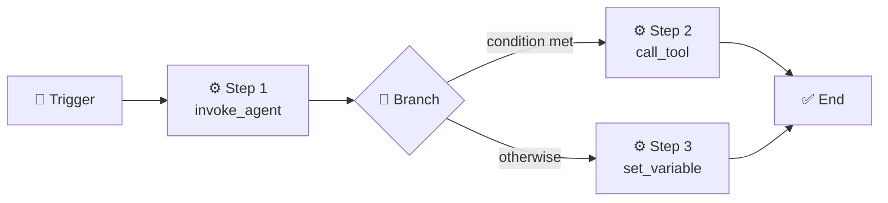

# Workflows

Workflows let you automate multi-step processes — from fully autonomous background pipelines to interactive chat-guided experiences.

Think of a workflow as an **automated recipe**: a sequence of steps that can call tools, invoke AI personas, wait for events, branch on conditions, and loop.

## Background vs Chat

Every workflow runs in one of two **modes**:

| | Background | Chat |
|---|---|---|
| **Where it runs** | Independently — no chat window needed | Inside a conversation thread |
| **Great for** | Automation, scheduled jobs, CI/CD hooks, event-driven pipelines | Guided multi-step interactions, onboarding flows, interactive research |
| **Trigger examples** | Cron schedule, webhook event, MCP notification | User starts it from the chat, or a bot launches it |
| **Human interaction** | Fire-and-forget (results appear on the Workflows page) | Can pause for feedback via `feedback_gate` |

::: tip Background vs Chat — which should I use?
**Background** when the workflow should run on its own — monitoring a repo, processing incoming emails, running nightly reports. **Chat** when you want the user in the loop — gathering input, presenting choices, or walking someone through a multi-step task.
:::

## Anatomy of a Workflow



A workflow definition contains a **trigger**, one or more **steps**, and optional **output** mappings.

### Triggers

Triggers decide *when* a workflow starts:

- **Manual** — launched by a user, with optional input forms.
- **Schedule** — fires on a cron expression (e.g. `0 9 * * MON`).
- **Event pattern** — matches events on an internal topic.
- **MCP notification** — reacts to notifications from a connected MCP server.
- **Incoming message** — triggers on messages from Slack, Discord, email, with optional filters.

### Task Steps

Task steps do the actual work:

| Kind | What it does |
|------|-------------|
| `call_tool` | Invokes a registered tool with arguments |
| `invoke_agent` | Spawns an AI agent with a persona and a task prompt |
| `invoke_prompt` | Resolves a persona's prompt template and runs it |
| `launch_workflow` | Starts another workflow (nested composition) |
| `schedule_task` | Registers a recurring job on a cron schedule |
| `signal_agent` | Sends a message to a running agent or session |
| `set_variable` | Assigns, appends, or merges values into the variable bag |
| `delay` | Pauses execution for a given number of seconds |

### Gates

Gates **pause** workflow execution until a condition is met:

- **`feedback_gate`** — surfaces a prompt in the chat UI and waits for the user to respond. Supports predefined choices and/or freeform text. *(Chat mode only.)*
- **`event_gate`** — waits for an external event on a topic, with an optional filter and timeout.

### Control Flow

- **`branch`** — evaluates a condition and routes to `then` or `else` step lists.
- **`for_each`** — iterates over a collection, binding each item to a variable.
- **`while`** — loops while a condition is true, with an optional max-iterations safety cap.
- **`end_workflow`** — immediately terminates the workflow.

### Error Handling

Each step can define an `on_error` strategy:

- **`retry`** — retry up to *N* times with a configurable delay.
- **`skip`** — skip the failed step and optionally inject a default output.
- **`goto`** — jump to a specific step.
- **`fail_workflow`** — abort the entire workflow with an error message.

## Variables & Data Flow

Workflows carry a **variable bag** — a JSON object that any step can read from or write to. The output of one step can flow into the input of the next via template expressions:

```yaml
- id: review
  type: task
  task:
    kind: invoke_agent
    persona_id: user/code-reviewer
    task: "Review the diff"
  outputs:
    summary: "{{result}}"

- id: post
  type: task
  task:
    kind: call_tool
    tool_id: connector.send_message
    arguments:
      body: "{{steps.review.outputs.summary}}"
```

<!-- prettier-ignore -->
::: v-pre
Expressions like `{{steps.review.outputs.summary}}`, `{{variables.repo_url}}`, and `{{trigger.inputs.branch}}` are resolved at runtime against the workflow's execution context.
:::

## Building Workflows

HiveMind OS offers three ways to author workflows:

1. **Visual Designer** — drag-and-drop canvas for wiring up triggers, steps, and branches.
2. **YAML Editor** — write definitions directly in the built-in editor. Definitions are stored in HiveMind's internal database, not as standalone files.
3. **AI Assist** — describe what you want in natural language and let HiveMind OS generate or modify the YAML for you.

## Launching Workflows

A workflow runs when its **trigger** fires. This creates an **instance** — a live execution of the workflow with its own state and progress.

- **Manual trigger** — you launch the workflow yourself. Background and chat workflows are launched from different places (see below).
- **Automatic triggers** (schedule, event, incoming message) — fire on their own once the workflow is saved. You can pause and resume triggers without deleting the workflow.
- **Nested launch** — a `launch_workflow` step inside one workflow starts another, enabling composition.

**Background workflows** are launched from the **workflow definitions view** (⚙ gear icon next to **Workflows** in the sidebar) — click the **Launch** button on a definition, fill in any inputs, and the instance appears on the Workflows page where you can track it.

**Chat workflows** are launched from the **Chat view** — click the **Launch a chat workflow** button in the composer toolbar, pick a workflow, and it attaches to your conversation. Agent outputs appear as messages, and `feedback_gate` steps pause to ask questions or present choices.

You can **monitor**, **pause**, **resume**, or **kill** running instances from the Workflows page at any time.

## Bundled Workflows

HiveMind OS ships with several ready-to-use workflows under the `system/` namespace — including an approval workflow, email responder, email triage, software feature lifecycle, and more. You can launch them directly or **copy** them to create a customized version under your own `user/` namespace.

See the [Workflows Guide → Bundled Workflows](/guides/workflows#bundled-workflows) for the full list.

## Example: Email Auto-Reply with Product Knowledge

A background workflow that responds to customer emails using your product manual as context:

```yaml
name: user/email-support-responder
mode: background

attachments:
  - id: product-manual
    filename: product-manual.pdf
    description: "Product manual — use as primary reference for answers"

steps:
  - id: trigger
    type: trigger
    trigger:
      type: incoming_message
      channel_id: email-support
      ignore_replies: true

  - id: respond
    type: task
    task:
      kind: invoke_agent
      persona_id: user/support-agent
      task: |
        Reply to this customer email using the product manual.
        From: {{trigger.from}}
        Subject: {{trigger.subject}}
        Body: {{trigger.body}}
      attachments:
        - product-manual
    outputs:
      reply: "{{result}}"

  - id: send
    type: task
    task:
      kind: call_tool
      tool_id: connector.send_message
      arguments:
        channel_id: email-support
        to: "{{trigger.from}}"
        subject: "Re: {{trigger.subject}}"
        body: "{{steps.respond.outputs.reply}}"
```

When an email arrives, HiveMind OS spawns a support agent with access to the uploaded product manual, drafts a knowledgeable response, and sends it — no human in the loop required.

## Testing & Shadow Mode

Building a workflow that sends emails, invokes agents, or calls external APIs is powerful — but mistakes during development can be costly (thousands of emails sent, LLM tokens burned, or data modified in production). HiveMind OS provides a built-in **test runner** and **shadow mode** to let you validate workflows safely before they go live.

### Shadow Mode

Every workflow test runs in **Shadow mode** — an execution mode where side-effecting actions are **intercepted and recorded** instead of actually executed. Shadow mode applies at every level:

- **`call_tool` steps** — tools classified as having side effects (writes, sends, deletes) are intercepted. Read-only tools still execute normally so the workflow has realistic data to work with.
- **`invoke_agent` steps** — the agent runs with `shadow_mode=true`, meaning any tools the agent calls with side effects are also intercepted. The agent still reasons and plans normally — it just can't *do* anything dangerous.
- **`launch_workflow`**, **`schedule_task`**, **`signal_agent`** — all intercepted and recorded.

Intercepted actions are stored with full details (tool ID, arguments, target workflow, etc.) so you can inspect exactly what *would have* happened in a real run.

### Test Cases

Test cases are defined directly in the workflow YAML under a `tests` key:

```yaml
name: user/email-support-responder
mode: background
steps:
  # ... steps ...

tests:
  - name: billing_inquiry
    description: "Routes billing questions to the billing team"
    inputs:
      from: "customer@example.com"
      subject: "Invoice question"
      body: "I need a copy of my last invoice."
    expectations:
      status: completed
      steps_completed: [classify, forward_to_billing]
      steps_not_reached: [auto_respond]

  - name: general_question
    inputs:
      from: "user@example.com"
      subject: "How do I reset my password?"
      body: "I forgot my password and can't log in."
    expectations:
      status: completed
      steps_completed: [classify, auto_respond, send_reply]
```

Each test case specifies:

| Field | Description |
|-------|-------------|
| `name` | A unique identifier for the test |
| `description` | Optional human-readable description |
| `inputs` | Trigger input data (simulates the incoming event) |
| `trigger_step_id` | Which trigger to activate (defaults to first) |
| `shadow_outputs` | Per-step output overrides — stubs for expensive or non-deterministic steps |
| `expected_tool_calls` | Assert that an agent step called specific tools with expected arguments |
| `expectations` | Assertions on the final workflow state |

### Shadow Outputs (Mocking Steps)

Use `shadow_outputs` to stub specific steps — the executor skips real execution and uses the provided value as the step's output. This is invaluable for:

- **Mocking LLM responses** — make agent steps deterministic by providing a fixed output
- **Isolating branches** — stub the classification step's output to test each routing path
- **Speed** — skip expensive steps when you only want to test control flow

```yaml
tests:
  - name: billing_route_test
    inputs:
      from: "test@example.com"
      subject: "Billing"
      body: "Invoice question"
    shadow_outputs:
      classify:
        category: "billing"
    expectations:
      status: completed
      steps_completed: [classify, forward_to_billing]
      steps_not_reached: [auto_respond]
```

### Expected Tool Calls

For agent steps that run in shadow mode (not mocked via `shadow_outputs`), you can assert which tools the agent attempted to call:

```yaml
tests:
  - name: agent_sends_email
    inputs:
      from: "customer@example.com"
      subject: "Help"
      body: "I need help with my account"
    expected_tool_calls:
      respond:
        - tool_id: comm.send_external_message
          arguments:
            to: "customer@example.com"
```

Arguments use **partial matching** — only the keys you specify are checked. The real call may have additional keys.

::: warning
`expected_tool_calls` and `shadow_outputs` cannot be used on the same step. A mocked step skips execution entirely and produces no intercepted actions to assert against.
:::

### Expectations

The `expectations` block asserts on the final state of the workflow:

| Field | What it checks |
|-------|---------------|
| `status` | Terminal status — `"completed"` or `"failed"` |
| `output` | Workflow output value (partial deep-equal) |
| `steps_completed` | Steps that must have reached `Completed` status |
| `steps_not_reached` | Steps that must NOT have been reached (`Pending` or `Skipped`) |
| `intercepted_action_counts` | Expected counts by kind (e.g. `tool_calls: 2`, `agent_invocations: 1`) |

### Agent Interactions in Tests

When an agent step runs during a test, the agent may call `ask_user` (to ask questions) or request tool approvals. In test mode, these interactions are **automatically responded to**:

- **`ask_user` questions** — the first choice is selected, or `"proceed"` is sent for freeform questions
- **Tool approvals** — automatically approved

These auto-responded interactions are recorded and visible in the test results under the **Actions** tab, alongside intercepted tool calls. This lets you verify that the agent asked the right questions and requested the right tools, even though no human was in the loop.

## Learn More

- [Workflows Guide](/guides/workflows) — Step-by-step tutorial for building, launching, and managing workflows
- [Workflows Guide → Running Tests](/guides/workflows#running-tests) — How to use the test runner in the visual designer
- [Email Support Workflow](/examples/pr-review-workflow) — Full end-to-end example with classification and attachments
- [Onboarding Chat Workflow](/examples/chat-workflow-onboarding) — Interactive guided workflow with feedback gates
- [Daily Automation](/examples/daily-automation) — Scheduled background workflow recipes
- [Tools & MCP](./tools-and-mcp) — How tools integrate with workflow steps
- [Personas](./personas) — Creating the AI agents your workflows invoke
