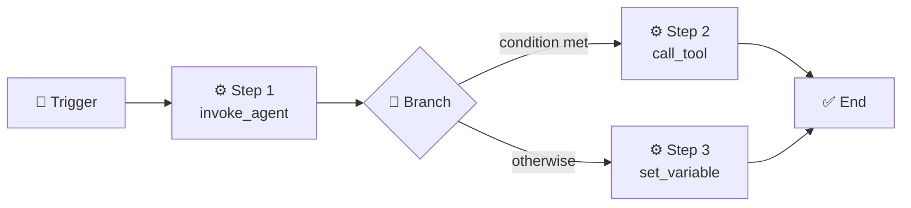

# Workflows

Workflows let you automate multi-step processes — from fully autonomous background pipelines to interactive chat-guided experiences.

Think of a workflow as an **automated recipe**: a sequence of steps that can call tools, invoke AI personas, wait for events, branch on conditions, and loop.

## Background vs Chat

Every workflow runs in one of two **modes**:

| | Background | Chat |
|---|---|---|
| **Where it runs** | Independently — no chat window needed | Inside a conversation thread |
| **Great for** | Automation, scheduled jobs, CI/CD hooks, event-driven pipelines | Guided multi-step interactions, onboarding flows, interactive research |
| **Trigger examples** | Cron schedule, webhook event, MCP notification | User starts it from the chat, or a bot launches it |
| **Human interaction** | Fire-and-forget (results appear on the Workflows page) | Can pause for feedback via `feedback_gate` |

::: tip Background vs Chat — which should I use?
**Background** when the workflow should run on its own — monitoring a repo, processing incoming emails, running nightly reports. **Chat** when you want the user in the loop — gathering input, presenting choices, or walking someone through a multi-step task.
:::

## Anatomy of a Workflow



A workflow definition contains a **trigger**, one or more **steps**, and optional **output** mappings.

### Triggers

Triggers decide *when* a workflow starts:

- **Manual** — launched by a user, with optional input forms.
- **Schedule** — fires on a cron expression (e.g. `0 9 * * MON`).
- **Event pattern** — matches events on an internal topic.
- **MCP notification** — reacts to notifications from a connected MCP server.
- **Incoming message** — triggers on messages from Slack, Discord, email, with optional filters.

### Task Steps

Task steps do the actual work:

| Kind | What it does |
|------|-------------|
| `call_tool` | Invokes a registered tool with arguments |
| `invoke_agent` | Spawns an AI agent with a persona and a task prompt |
| `invoke_prompt` | Resolves a persona's prompt template and runs it |
| `launch_workflow` | Starts another workflow (nested composition) |
| `schedule_task` | Registers a recurring job on a cron schedule |
| `signal_agent` | Sends a message to a running agent or session |
| `set_variable` | Assigns, appends, or merges values into the variable bag |
| `delay` | Pauses execution for a given number of seconds |

### Gates

Gates **pause** workflow execution until a condition is met:

- **`feedback_gate`** — surfaces a prompt in the chat UI and waits for the user to respond. Supports predefined choices and/or freeform text. *(Chat mode only.)*
- **`event_gate`** — waits for an external event on a topic, with an optional filter and timeout.

### Control Flow

- **`branch`** — evaluates a condition and routes to `then` or `else` step lists.
- **`for_each`** — iterates over a collection, binding each item to a variable.
- **`while`** — loops while a condition is true, with an optional max-iterations safety cap.
- **`end_workflow`** — immediately terminates the workflow.

### Error Handling

Each step can define an `on_error` strategy:

- **`retry`** — retry up to *N* times with a configurable delay.
- **`skip`** — skip the failed step and optionally inject a default output.
- **`goto`** — jump to a specific step.
- **`fail_workflow`** — abort the entire workflow with an error message.

## Variables & Data Flow

Workflows carry a **variable bag** — a JSON object that any step can read from or write to. The output of one step can flow into the input of the next via template expressions:

```yaml
- id: review
  type: task
  task:
    kind: invoke_agent
    persona_id: user/code-reviewer
    task: "Review the diff"
  outputs:
    summary: "{{result}}"

- id: post
  type: task
  task:
    kind: call_tool
    tool_id: connector.send_message
    arguments:
      body: "{{steps.review.outputs.summary}}"
```

<!-- prettier-ignore -->
::: v-pre
Expressions like `{{steps.review.outputs.summary}}`, `{{variables.repo_url}}`, and `{{trigger.inputs.branch}}` are resolved at runtime against the workflow's execution context.
:::

## Building Workflows

HiveMind OS offers three ways to author workflows:

1. **Visual Designer** — drag-and-drop canvas for wiring up triggers, steps, and branches.
2. **YAML Editor** — write definitions directly in the built-in editor. Definitions are stored in HiveMind's internal database, not as standalone files.
3. **AI Assist** — describe what you want in natural language and let HiveMind OS generate or modify the YAML for you.

## Launching Workflows

A workflow runs when its **trigger** fires. This creates an **instance** — a live execution of the workflow with its own state and progress.

- **Manual trigger** — you click **Launch** on the Workflows page, fill in any input fields, and the workflow starts.
- **Automatic triggers** (schedule, event, incoming message, MCP notification) — fire on their own once the workflow is saved. You can pause and resume triggers without deleting the workflow.
- **Nested launch** — a `launch_workflow` step inside one workflow starts another, enabling composition.

**Background** instances run independently and appear on the Workflows page. **Chat** instances are launched from the **Chat view** and attach to a conversation — agent outputs appear as messages, and `feedback_gate` steps pause to ask questions or present choices.

You can **monitor**, **pause**, **resume**, or **kill** running instances from the Workflows page at any time.

## Bundled Workflows

HiveMind OS ships with several ready-to-use workflows under the `system/` namespace — including an approval workflow, email responder, email triage, software feature lifecycle, and more. You can launch them directly or **copy** them to create a customized version under your own `user/` namespace.

See the [Workflows Guide → Bundled Workflows](/guides/workflows#bundled-workflows) for the full list.

## Example: Email Auto-Reply with Product Knowledge

A background workflow that responds to customer emails using your product manual as context:

```yaml
name: user/email-support-responder
mode: background

attachments:
  - id: product-manual
    filename: product-manual.pdf
    description: "Product manual — use as primary reference for answers"

steps:
  - id: trigger
    type: trigger
    trigger:
      type: incoming_message
      channel_id: email-support
      ignore_replies: true

  - id: respond
    type: task
    task:
      kind: invoke_agent
      persona_id: user/support-agent
      task: |
        Reply to this customer email using the product manual.
        From: {{trigger.from}}
        Subject: {{trigger.subject}}
        Body: {{trigger.body}}
      attachments:
        - product-manual
    outputs:
      reply: "{{result}}"

  - id: send
    type: task
    task:
      kind: call_tool
      tool_id: connector.send_message
      arguments:
        channel_id: email-support
        to: "{{trigger.from}}"
        subject: "Re: {{trigger.subject}}"
        body: "{{steps.respond.outputs.reply}}"
```

When an email arrives, HiveMind OS spawns a support agent with access to the uploaded product manual, drafts a knowledgeable response, and sends it — no human in the loop required.

## Learn More

- [Workflows Guide](/guides/workflows) — Step-by-step tutorial for building, launching, and managing workflows
- [Email Support Workflow](/examples/pr-review-workflow) — Full end-to-end example with classification and attachments
- [Onboarding Chat Workflow](/examples/chat-workflow-onboarding) — Interactive guided workflow with feedback gates
- [Daily Automation](/examples/daily-automation) — Scheduled background workflow recipes
- [Tools & MCP](./tools-and-mcp) — How tools integrate with workflow steps
- [Personas](./personas) — Creating the AI agents your workflows invoke
