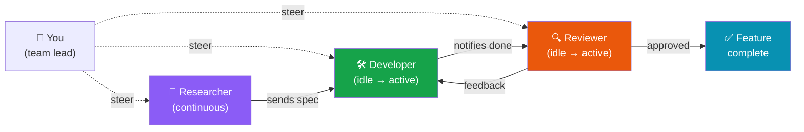

# Multi-Bot Feature Development

This recipe launches a three-bot team that collaborates to research, implement, and review a feature — with you as the team lead. Watch them pass work between each other in the **Agent Stage** while you focus on the big picture.



## The Team

| Bot | Persona | Mode | Role |
|-----|---------|------|------|
| 🔬 **Researcher** | `user/researcher` | Continuous | Gathers requirements, finds patterns, compiles specs |
| 🛠️ **Developer** | `user/developer` | Idle After Task | Implements the feature based on research |
| 🔍 **Reviewer** | `user/code-reviewer` | Idle After Task | Reviews the implementation, sends feedback |

The **Researcher** runs continuously — always gathering context. The **Developer** and **Reviewer** wait in idle mode, ready to jump in when they receive work.

## Step 1: Create the Personas

If you don't already have these, create them in **Settings → Personas**:

### Researcher Persona

```yaml
id: user/researcher
name: Researcher
description: Gathers requirements, researches patterns, and compiles specifications
avatar: 🔬
color: "#8b5cf6"
system_prompt: |
  You are a senior technical researcher. Your job is to gather
  comprehensive requirements and find existing patterns before
  any code gets written.

  When researching a feature:
  1. Search the existing codebase for related patterns
  2. Look for similar implementations in the project
  3. Check for relevant tests and documentation
  4. Research best practices via web search
  5. Compile findings into a clear specification

  Always structure your output as:
  - Requirements (must-have vs nice-to-have)
  - Existing patterns to follow
  - Recommended approach
  - Edge cases to handle
  - Suggested test cases
preferred_models:
  - claude-sonnet
loop_strategy: plan_then_execute
allowed_tools:
  - filesystem.read
  - filesystem.search
  - filesystem.glob
  - http.request
  - knowledge.query
```

### Developer Persona

```yaml
id: user/developer
name: Developer
description: Implements features with clean, tested code
avatar: 🛠️
color: "#16a34a"
system_prompt: |
  You are a senior software engineer. You write clean, well-tested,
  production-ready code.

  When implementing a feature:
  1. Review the requirements carefully
  2. Plan your approach before writing code
  3. Follow existing patterns in the codebase
  4. Write tests alongside implementation
  5. Handle errors and edge cases
  6. Add documentation where needed

  When you receive review feedback, address every point
  systematically and explain what you changed.
preferred_models:
  - claude-sonnet
loop_strategy: plan_then_execute
allowed_tools:
  - "*"
```

### Code Reviewer Persona

```yaml
id: user/code-reviewer
name: Code Reviewer
description: Reviews implementations for correctness, security, and quality
avatar: 🔍
color: "#ea580c"
system_prompt: |
  You are a thorough code reviewer. You check for correctness,
  security, performance, and maintainability.

  For every review:
  1. Verify the implementation matches requirements
  2. Check for bugs and edge cases
  3. Look for security vulnerabilities
  4. Evaluate test coverage and quality
  5. Assess code clarity and naming

  Rate findings as: Blocker / Important / Suggestion / Nitpick.
  If there are blockers, request changes. Otherwise, approve.
preferred_models:
  - claude-sonnet
loop_strategy: react
allowed_tools:
  - filesystem.read
  - filesystem.search
  - filesystem.glob
  - shell.execute
```

## Step 2: Launch the Bots

Open the **Bots** page and launch each one:

### 🔬 Researcher Bot

```yaml
friendly_name: "Feature Researcher"
persona_id: user/researcher
mode: continuous
launch_prompt: |
  Research everything needed to implement a rate-limiting middleware
  for our REST API. Investigate:

  1. How our API routes are currently structured
  2. Existing middleware patterns in the codebase
  3. Best practices for rate limiting (token bucket, sliding window, etc.)
  4. What libraries or crates are available
  5. How other similar projects handle this

  Compile a detailed specification document. When you're done,
  send your findings to the Developer bot.
data_class: PUBLIC
```

### 🛠️ Developer Bot

```yaml
friendly_name: "Feature Developer"
persona_id: user/developer
mode: idle_after_task
launch_prompt: |
  You're the developer for our rate-limiting feature. Wait for the
  Researcher bot to send you requirements, then implement the feature.

  When you receive the specification:
  1. Plan your implementation approach
  2. Implement the rate-limiting middleware
  3. Write unit and integration tests
  4. Update documentation
  5. Notify the Reviewer bot when you're done
data_class: INTERNAL
allowed_tools:
  - "*"
permission_rules:
  - tool_pattern: "shell.execute"
    path: "/workspace/**"
    action: ask
```

### 🔍 Reviewer Bot

```yaml
friendly_name: "Feature Reviewer"
persona_id: user/code-reviewer
mode: idle_after_task
launch_prompt: |
  You're the code reviewer for our rate-limiting feature. Wait for
  the Developer bot to notify you, then review the implementation.

  When reviewing:
  1. Check that the implementation matches the Researcher's spec
  2. Verify test coverage and edge cases
  3. Look for security issues and performance concerns
  4. If you find blockers, send feedback to the Developer bot
  5. If approved, send a summary to the user
data_class: INTERNAL
```

## Step 3: Watch the Collaboration

Open the **Agent Stage** from the sidebar to see the bots working together in real time:

```
┌──────────────────────────────────────────────────────────────┐
│                      Agent Stage                             │
│                                                              │
│  ┌──────────────┐                                            │
│  │ 🔬 Researcher │ ── status: Active ─── searching...       │
│  │  (continuous) │                                           │
│  └──────┬───────┘                                            │
│         │  sends spec                                        │
│         ▼                                                    │
│  ┌──────────────┐                                            │
│  │ 🛠️ Developer  │ ── status: Idle ─── waiting for work     │
│  │  (idle)       │                                           │
│  └──────┬───────┘                                            │
│         │  notifies when done                                │
│         ▼                                                    │
│  ┌──────────────┐                                            │
│  │ 🔍 Reviewer   │ ── status: Idle ─── waiting for work     │
│  │  (idle)       │                                           │
│  └──────┬───────┘                                            │
│         │  feedback (if needed)                               │
│         └──────────► back to Developer                       │
│                                                              │
└──────────────────────────────────────────────────────────────┘
```

As the collaboration unfolds:

1. **Researcher** scans the codebase, searches the web, and compiles findings
2. **Researcher → Developer**: sends the specification via inter-bot messaging
3. **Developer** wakes up, plans, and implements the feature
4. **Developer → Reviewer**: notifies that implementation is ready
5. **Reviewer** wakes up, reviews all changed files, and either approves or sends feedback
6. **Reviewer → Developer** (if needed): sends change requests back
7. **Developer** addresses feedback and notifies Reviewer again — the cycle repeats

## Step 4: Interact with Individual Bots

You can message any bot directly from the Bots dashboard:

**Message the Researcher** to refine the search:
```
Also research how to handle rate limiting across multiple
server instances. We might need Redis or a distributed counter.
```

**Message the Developer** to adjust priorities:
```
Focus on the token bucket algorithm first. We can add
sliding window support in a follow-up PR.
```

**Message the Reviewer** to set review standards:
```
Pay extra attention to thread safety. Our API serves
concurrent requests and the rate limiter must be safe.
```

::: tip The team lead pattern
You don't need to micromanage. Set the bots up with clear launch prompts, then only intervene when you want to steer direction. The bots handle coordination through their inter-bot messaging — you see all of it in the Agent Stage.
:::

## Collaboration Flow Variations

### Pipeline (Sequential)
```
Researcher → Developer → Reviewer  (one direction)
```

### Feedback Loop (Iterative)
```
Researcher → Developer ⇄ Reviewer  (cycles until approved)
```

### Fan-Out (Parallel)
```
Researcher → Developer A (backend) + Developer B (frontend) → Reviewer
```

For fan-out, launch multiple developer bots with different personas and scoped instructions. The reviewer bot can review all changes together.

::: warning Resource awareness
Three bots running simultaneously consume tokens across three concurrent model sessions. For cost-sensitive workflows, consider using one-shot mode for the Researcher (it only needs to run once) and idle mode for the others.
:::

## Related

- [Bots Guide](/guides/bots) — Bot modes, messaging, and the Agent Stage
- [Personas Guide](/guides/personas) — Creating the personas behind each bot
- [PR Review Workflow](/examples/pr-review-workflow) — Automate the review step as a workflow instead
