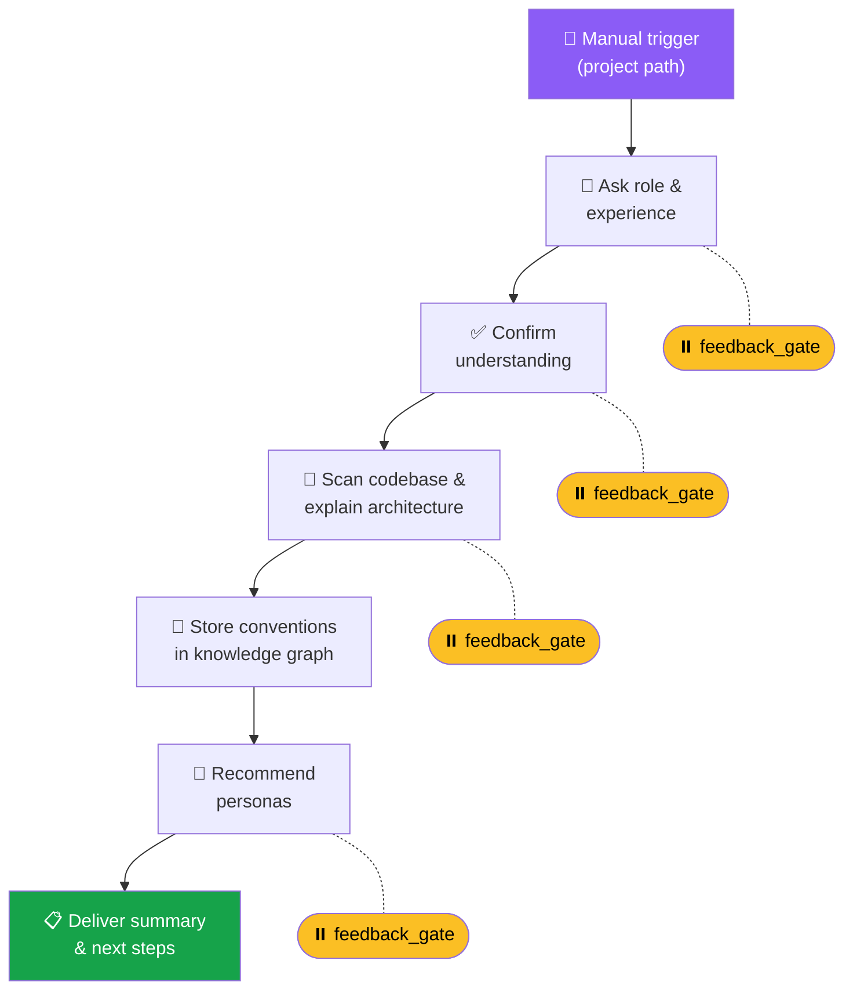

# Interactive Project Onboarding

This recipe builds a **chat workflow** that guides a new team member through project setup step by step — asking questions, confirming understanding, scanning the codebase, and setting up personalized tools.

## What You'll Build



A six-step interactive onboarding assistant that:

1. Asks about the new member's role and experience level
2. Confirms understanding before proceeding
3. Scans the codebase and explains the architecture
4. Stores project conventions in the knowledge graph
5. Creates recommended personas tailored to the project
6. Delivers a summary with next steps

The entire flow runs inside a chat conversation with **feedback gates** that pause for human input at key moments.

## The Full Workflow

Open the workflow definitions view (⚙ gear icon next to **Workflows**), click **New Workflow**, set mode to **Chat**, and paste:

```yaml
name: user/project-onboarding
description: Interactive onboarding for new team members
mode: chat
version: "1.0"

variables:
  type: object
  properties:
    member_role:
      type: string
    experience_level:
      type: string
    project_summary:
      type: string

steps:
  # ── Trigger: manually launched from chat ────────────────────
  - id: trigger
    type: trigger
    trigger:
      type: manual
      input_schema:
        type: object
        properties:
          projectPath:
            type: string
            description: Path to the project root
        required: [projectPath]

  # ── Step 1: Ask about role and experience ───────────────────
  - id: ask_role
    type: task
    task:
      kind: feedback_gate
      prompt: |
        👋 Welcome to the team! Let's get you set up.

        Tell me about yourself:
        - What's your role? (e.g., frontend, backend, full-stack, DevOps)
        - What's your experience level with this tech stack?
        - Any specific areas you'd like to focus on?
      allow_freeform: true

  # ── Step 2: Confirm understanding ───────────────────────────
  - id: save_role
    type: task
    task:
      kind: set_variable
      assignments:
        - variable: member_role
          value: "{{steps.ask_role.output}}"
          operation: set

  - id: confirm_understanding
    type: task
    task:
      kind: invoke_agent
      persona_id: system/general
      task: |
        Based on this team member's response, summarize their role
        and experience in 2-3 sentences. Then ask: "Did I get that
        right? Anything you'd like to add?"

        Their response: {{variables.member_role}}
      agent_name: "Onboarding Guide"

  - id: confirm_gate
    type: task
    task:
      kind: feedback_gate
      prompt: "Does this look right? Say 'yes' to continue or correct anything."
      choices:
        - "Yes, let's continue!"
        - "Let me clarify..."
      allow_freeform: true

  # ── Step 3: Scan codebase and explain architecture ──────────
  - id: scan_codebase
    type: task
    task:
      kind: invoke_agent
      persona_id: system/general
      task: |
        Scan the project at {{trigger.input.projectPath}} and create a
        comprehensive architecture overview for a new team member.

        Include:
        1. Project structure (top-level directories and their purpose)
        2. Tech stack and key dependencies
        3. Entry points and main execution flow
        4. Testing setup and how to run tests
        5. Build and deploy process

        This person is a {{variables.member_role}}.
        Tailor the explanation to their background.
      timeout_secs: 180
      agent_name: "Codebase Scanner"

  - id: architecture_review
    type: task
    task:
      kind: feedback_gate
      prompt: |
        Take a look at the architecture overview above. 👆

        Any questions about the codebase structure? Or shall we
        move on to setting up your development environment?
      choices:
        - "Looks good, let's continue"
        - "I have questions"
      allow_freeform: true

  # ── Step 4: Store conventions in the knowledge graph ────────
  - id: store_conventions
    type: task
    task:
      kind: invoke_agent
      persona_id: system/general
      task: |
        Analyze the project at {{trigger.input.projectPath}} and extract
        key conventions. Use the knowledge graph to store:

        1. Coding style conventions (naming, formatting, patterns)
        2. Git workflow (branching strategy, commit message format)
        3. Review process and PR requirements
        4. Testing conventions (what to test, coverage expectations)
        5. Architecture decisions and rationale

        Look at: README, CONTRIBUTING.md, .editorconfig, linter configs,
        existing code patterns, and git history.

        Store each convention as a knowledge graph entity in the
        "project-conventions" scope so all team personas can access them.
      timeout_secs: 120
      agent_name: "Convention Scanner"

  # ── Step 5: Create recommended personas ─────────────────────
  - id: create_personas
    type: task
    task:
      kind: invoke_agent
      persona_id: system/general
      task: |
        Based on the project analysis and the new team member's role
        ({{variables.member_role}}), recommend and describe 2-3 custom
        personas that would be useful for this project.

        For each persona, provide:
        - Name and description
        - Suggested system prompt
        - Recommended tools and model
        - Example use cases

        Tailor recommendations to the tech stack and the member's role.
        Don't create the personas — just describe them so the user can
        decide which ones to set up.
      timeout_secs: 120
      agent_name: "Persona Advisor"

  - id: persona_gate
    type: task
    task:
      kind: feedback_gate
      prompt: |
        These are my recommended personas for your workflow. 👆

        Would you like me to create any of them? You can always
        create or modify personas later in Settings → Personas.
      choices:
        - "Create all of them"
        - "Let me pick which ones"
        - "Skip for now"
      allow_freeform: true

  # ── Step 6: Summary and next steps ─────────────────────────
  - id: summary
    type: task
    task:
      kind: invoke_agent
      persona_id: system/general
      task: |
        Create a concise onboarding summary for this new team member.

        Include:
        1. ✅ What we covered today
        2. 📁 Key files and directories to know
        3. 🧪 How to run tests and validate changes
        4. 🧑‍💻 Recommended first tasks to get familiar
        5. 📚 Links to internal docs and resources
        6. 💡 Tips specific to their role ({{variables.member_role}})

        Make it actionable — they should be able to start contributing
        after reading this summary.
      agent_name: "Onboarding Guide"

result_message: |
  ## 🎉 Onboarding Complete!

  {{steps.summary.output}}

  ---
  *Welcome aboard! Run this workflow again anytime to refresh your
  project knowledge, or ask any persona for help.*
```

## How the Conversation Flows

Here's what the new team member experiences in chat:

```
🤖 Onboarding Guide: 👋 Welcome to the team! Tell me about yourself...
                       [text input field]

👤 You: I'm a backend engineer, 3 years of experience, mostly Python
        but learning Rust. Interested in the API layer.

🤖 Onboarding Guide: Got it — you're a mid-level backend engineer
                       transitioning from Python to Rust, focused on
                       the API layer. Did I get that right?
                       [Yes, let's continue!] [Let me clarify...]

👤 You: [clicks "Yes, let's continue!"]

🤖 Codebase Scanner: 📁 Here's the project architecture...
                      (detailed breakdown tailored to backend focus)

🤖 Onboarding Guide: Any questions, or shall we continue?
                       [Looks good, let's continue] [I have questions]

   ... (continues through conventions, personas, summary)
```

::: tip Feedback gates are your friend
Every `feedback_gate` creates a natural pause where the person can absorb information, ask questions, or redirect the flow. Don't rush — onboarding is about understanding, not speed.
:::

## Customization Ideas

- **Add a `branch` step** after the role question to provide different paths for frontend vs backend vs DevOps engineers
- **Add an `invoke_prompt`** step to run a persona's "setup-dev-environment" prompt template with the project path as a parameter
- **Connect to Slack** — trigger this workflow automatically when a new member joins a channel via `incoming_message` trigger
- **Add a `for_each`** loop to scan multiple repositories if your project is a monorepo or multi-repo setup

## Related

- [Workflows Guide](/guides/workflows) — Step types, feedback gates, and control flow
- [Personas Guide](/guides/personas) — Creating the personas referenced in this workflow
- [Knowledge Management Guide](/guides/knowledge-management) — How the knowledge graph stores conventions
