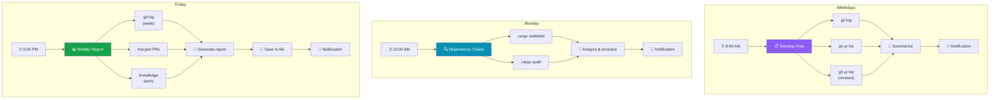

# Developer's Daily Automation

Set up **scheduled background workflows** that handle your daily routines automatically — standup prep, dependency checks, and weekly reports, all running on cron triggers.

## 1. Morning Standup Prep

Every weekday at 9:00 AM, this workflow summarizes yesterday's commits, open PRs, and pending reviews so you walk into standup fully prepared:

```yaml
# workflows/standup-prep.yaml
name: user/morning-standup-prep
version: "1.0"
mode: background

steps:
  - id: trigger
    type: trigger
    trigger:
      type: schedule
      cron: "0 9 * * 1-5"

  - id: gather-commits
    type: task
    task:
      kind: call_tool
      tool_id: shell.execute
      arguments:
        command: "git log --oneline --since='yesterday 00:00' --author='$(git config user.name)'"

  - id: gather-open-prs
    type: task
    task:
      kind: call_tool
      tool_id: shell.execute
      arguments:
        command: "gh pr list --author=@me --state=open"

  - id: gather-pending-reviews
    type: task
    task:
      kind: call_tool
      tool_id: shell.execute
      arguments:
        command: "gh pr list --search 'review-requested:@me' --state=open"

  - id: summarize
    type: task
    task:
      kind: invoke_agent
      persona_id: system/general
      task: |
        Create a concise standup summary from this data:

        **My commits yesterday:**
        {{steps.gather-commits.output}}

        **My open PRs:**
        {{steps.gather-open-prs.output}}

        **PRs awaiting my review:**
        {{steps.gather-pending-reviews.output}}

        Format as bullet points under three headings:
        "What I did", "What's in progress", "Blockers & reviews needed".
        Keep it under 200 words.

  - id: notify
    type: task
    task:
      kind: signal_agent
      target:
        type: session
        session_id: "{{trigger.session_id}}"
      content: "📋 Standup prep ready\n\n{{steps.summarize.output}}"
```

**Expected output** (delivered as a notification at 9:00 AM):

```
📋 Standup prep ready

**What I did**
- Fixed race condition in connection pool (#342)
- Added retry logic for webhook deliveries (3 commits)

**What's in progress**
- PR #347: Migrate user service to async — waiting on CI
- PR #351: Add rate limiting middleware — 2 approvals, needs rebase

**Blockers & reviews needed**
- PR #339 (Jake): Auth refactor — review requested 2 days ago
```

## 2. Dependency Check

Every Monday at 10:00 AM, scan for outdated and vulnerable dependencies:

```yaml
# workflows/dependency-check.yaml
name: user/weekly-dependency-check
version: "1.0"
mode: background

steps:
  - id: trigger
    type: trigger
    trigger:
      type: schedule
      cron: "0 10 * * 1"

  - id: check-outdated
    type: task
    task:
      kind: call_tool
      tool_id: shell.execute
      arguments:
        command: "cargo outdated --depth 1"

  - id: check-vulnerabilities
    type: task
    task:
      kind: call_tool
      tool_id: shell.execute
      arguments:
        command: "cargo audit"

  - id: analyze
    type: task
    task:
      kind: invoke_agent
      persona_id: system/general
      task: |
        Analyze these dependency reports and create a prioritized action list:

        **Outdated dependencies:**
        {{steps.check-outdated.output}}

        **Security vulnerabilities:**
        {{steps.check-vulnerabilities.output}}

        Categorize each item as:
        🔴 Critical (security vulnerability, must fix now)
        🟡 Important (major version behind, should update soon)
        🟢 Low priority (minor/patch updates)

        For critical items, note the CVE and affected version range.

  - id: notify
    type: task
    task:
      kind: signal_agent
      target:
        type: session
        session_id: "{{trigger.session_id}}"
      content: "🔍 Dependency check complete\n\n{{steps.analyze.output}}"
```

::: tip Adapt to Your Ecosystem
Replace `cargo outdated` and `cargo audit` with the equivalent for your stack — `npm outdated` / `npm audit`, `pip list --outdated` / `pip-audit`, or `go list -m -u all` / `govulncheck ./...`.
:::

## 3. Weekly Accomplishments Report

Every Friday at 5:00 PM, generate a summary of the week's work from git history and completed tasks:

```yaml
# workflows/weekly-report.yaml
name: user/weekly-accomplishments
version: "1.0"
mode: background

steps:
  - id: trigger
    type: trigger
    trigger:
      type: schedule
      cron: "0 17 * * 5"

  - id: week-commits
    type: task
    task:
      kind: call_tool
      tool_id: shell.execute
      arguments:
        command: "git log --oneline --since='last monday 00:00' --author='$(git config user.name)'"

  - id: merged-prs
    type: task
    task:
      kind: call_tool
      tool_id: shell.execute
      arguments:
        command: "gh pr list --author=@me --state=closed --search 'merged:>=last-monday'"

  - id: recall-context
    type: task
    task:
      kind: call_tool
      tool_id: knowledge.query
      arguments:
        query: "completed tasks this week"

  - id: generate-report
    type: task
    task:
      kind: invoke_agent
      persona_id: system/general
      task: |
        Write a weekly accomplishments report from this data:

        **Commits this week:**
        {{steps.week-commits.output}}

        **Merged PRs:**
        {{steps.merged-prs.output}}

        **Context from knowledge graph:**
        {{steps.recall-context.output}}

        Structure the report as:
        1. **Key accomplishments** (3-5 bullet points, impact-focused)
        2. **In progress** (what carries over to next week)
        3. **Metrics** (commits, PRs merged, reviews completed)

        Keep it professional and under 300 words.

  - id: generate-filename
    type: task
    task:
      kind: call_tool
      tool_id: shell.execute
      arguments:
        command: "date +%Y-%m-%d"

  - id: save-report
    type: task
    task:
      kind: call_tool
      tool_id: filesystem.write
      arguments:
        path: "reports/weekly/{{steps.generate-filename.output}}.md"
        content: "{{steps.generate-report.output}}"

  - id: notify
    type: task
    task:
      kind: signal_agent
      target:
        type: session
        session_id: "{{trigger.session_id}}"
      content: "📊 Weekly report saved\n\n{{steps.generate-report.output}}"
```

## How They Work Together

These three workflows form a lightweight automation layer for your development routine:



| Workflow | Schedule | Output |
|----------|----------|--------|
| Standup prep | Weekdays 9 AM | Notification with summary |
| Dependency check | Monday 10 AM | Prioritized audit + notification |
| Weekly report | Friday 5 PM | Markdown file + notification |

Previous audit results are available through the knowledge graph, so you can later ask:

```
You: What vulnerabilities were found in the last dependency audit?
```

::: tip Start Simple
You don't need all three at once. Start with the standup prep workflow — it delivers value immediately and helps you get comfortable with the cron trigger system before adding more automations.
:::
