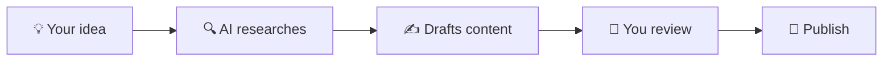

# Content Creation Assistant

Turn rough ideas into polished content — blog posts, social media updates, email campaigns, and more. Just describe what you need, and HiveMind OS writes a first draft you can refine and publish.

::: tip
New to HiveMind OS? Check the [Glossary](/glossary) for quick definitions of terms like persona, connector, workflow, and trigger.
:::

## What You'll Need

| Item | Details |
|------|---------|
| **AI provider** | At least one [provider](/glossary#provider) configured (see [Quickstart](/getting-started/quickstart)) |
| **Time** | About 5 minutes to create the persona |

That's it — no connectors required for basic content creation. You'll chat directly with HiveMind OS.

---

## Step 1: Create a Content Writer Persona

A [persona](/glossary#persona) shapes *how* the AI writes. By creating a dedicated Content Writer, every piece of content will match your brand's voice.

1. Click **Settings** in the sidebar, then click **Personas**.
2. Click **New Persona**.
3. Fill in the fields:

| Field | What to enter |
|-------|---------------|
| **Name** | `Content Writer` |
| **Description** | `Drafts blog posts, social media, and marketing copy in our brand voice` |
| **Avatar** | Pick ✍️ or 📝 |
| **Color** | Choose something creative — maybe purple or teal |

4. In the **System Prompt** box, describe your brand voice and writing guidelines. Here's an example:

> You are a skilled content writer for a small business. When creating content:
>
> **Brand voice:** Friendly, approachable, and professional. We sound like a knowledgeable friend, not a corporate manual.
>
> **Audience:** Small business owners who are busy and practical. They want actionable advice, not jargon.
>
> **Writing rules:**
> - Use short paragraphs (2–3 sentences max)
> - Include specific examples and actionable tips
> - Write in active voice
> - Avoid buzzwords and corporate speak
> - For blog posts: aim for 600–800 words with clear headings
> - For social media: keep it punchy and under the character limit
> - For emails: get to the point in the first sentence

The [system prompt](/glossary#system-prompt) is your brand voice blueprint — the more specific you make it, the less editing you'll need.

::: tip
Include examples of phrases you love (and ones you hate) in the system prompt for even better results.
:::

5. Click **Save**.

## Step 2: Start Creating

Select your **Content Writer** persona from the persona picker at the top of the chat, then type what you need. Here are some examples to try:

### Blog Post

> Write a blog post about why small businesses should automate their customer support. Our audience is other small business owners who are skeptical about AI.

### Social Media

> Create 5 social media posts promoting our new online booking system. Keep each one under 280 characters. Mix informational and fun tones.

### Email Campaign

> Draft a monthly newsletter summarizing these updates:
> - We launched a new product page
> - Holiday hours: closed Dec 24–26
> - Customer spotlight: Rivera's Bakery increased sales 30%

### Product Description

> Write a product description for our Premium Support Plan ($49/month). Highlight: 24/7 email support, 1-hour response time, dedicated account manager. Keep it under 150 words.

The AI drafts content right in the chat. You can reply with feedback like "make it more casual" or "add a call-to-action at the end" and it will revise immediately.

## Step 3: Teach It Your Brand

The more HiveMind OS knows about your business, the better the content gets. Use the chat to tell it things it should always remember:

- *"We always say 'customers' not 'users.' Our tone is friendly but professional."*
- *"Our company tagline is 'Grow smarter, not harder.' Work it into blog posts when natural."*
- *"We never badmouth competitors. Focus on our strengths instead."*

HiveMind OS stores this in its [knowledge graph](/concepts/knowledge-graph) (the AI's long-term memory), so you won't have to repeat yourself. Next time you ask for content, it already knows your preferences.

::: tip
Think of the knowledge graph as your brand style guide that the AI actually reads and follows. The more you teach it, the less you'll need to edit.
:::

---

## Level Up: Automate with Workflows

Once you're happy with the quality, consider automating content creation with [workflows](/glossary#workflow):

- **Weekly blog drafts** — Create a workflow with a schedule [trigger](/glossary#trigger) (every Monday at 9 AM) that generates a blog post draft based on trending topics in your industry.
- **Social media on autopilot** — Trigger content drafts whenever you add a new product or publish a blog post.
- **Newsletter assembly** — Automatically pull the week's highlights and draft a newsletter every Friday.

To create a workflow, click the **⚙ gear icon** next to **Workflows** in the sidebar to open the workflow definitions view, then click **New Workflow** — the same point-and-click setup you've seen in the other use cases.

### Test Before Going Live

When you set up an automated content workflow:

1. Save the workflow but leave the trigger **disabled** at first.
2. In the workflow definitions view (click the **⚙ gear icon** next to **Workflows** in the sidebar), find your workflow and click the **Launch** button to run it once manually.
3. Follow the launch wizard: select the trigger, fill in any inputs, review, and click **Launch**.
4. Click **Workflows** in the sidebar (not the gear icon) to see running and completed instances. Review the generated content.
5. Once satisfied with the output, go back to the workflow definition and toggle the trigger to **Enabled** for automatic runs.

---

## Tips for Better Content

### Be Specific in Your Requests

Instead of *"Write a blog post about marketing,"* try *"Write a blog post about 3 low-cost marketing strategies for local restaurants. Include real examples."* Specific prompts get dramatically better results.

### Provide Examples

If you have a blog post you love, paste it into the chat and say *"Write in this style."* The AI picks up on tone, structure, and vocabulary.

### Iterate with Follow-ups

Your first draft is a starting point. Use follow-up messages to refine:
- *"Shorten the intro — get to the tips faster."*
- *"Add a section about common mistakes."*
- *"Make it sound more enthusiastic."*

### Keep a Swipe File

When the AI produces something great, save it. Over time, you'll build a library of content you can reference, repurpose, and remix.

---

## Related

- [Customer Support](/use-cases/customer-support) — Auto-reply to customer emails with AI
- [Daily Briefing](/use-cases/daily-briefing) — Start your morning with an automated summary
- [Personas Guide](/guides/personas) — Deep dive into persona creation and system prompts
- [Knowledge Graph](/concepts/knowledge-graph) — How HiveMind OS remembers your preferences
