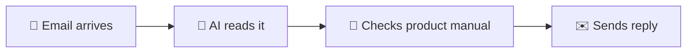

# Auto-Reply to Customer Emails

Stop spending hours answering the same questions. With HiveMind OS, incoming customer emails are read by an AI that knows your product — and replies in seconds.

## What You'll Need

| Item | Details |
|------|---------|
| **Email connector** | Gmail, Microsoft 365, or any IMAP account |
| **Product manual** | A PDF, Word doc, or text file describing your products or services |
| **Time** | About 10 minutes |

---

## Step 1: Connect Your Email

1. Open HiveMind OS and go to **Settings → Connectors**.
2. Click **Add Connector**.
3. Choose your email provider — **Gmail**, **Microsoft 365**, or **IMAP**.
4. Follow the on-screen prompts to authorize access. For Gmail and Microsoft 365, you'll sign in with your existing account. For IMAP, enter your server details and credentials.
5. Once connected, you'll see a green checkmark next to your email connector.

::: tip
You can connect multiple email accounts if you handle support from more than one inbox.
:::

## Step 2: Create a Support Persona

A persona tells the AI *how* to behave. Think of it as hiring a virtual employee and giving them their job description.

1. Go to **Settings → Personas**.
2. Click **New Persona**.
3. Fill in the fields:

| Field | What to enter |
|-------|---------------|
| **Name** | `Customer Support` |
| **Description** | `Answers customer emails using our product knowledge` |
| **Avatar** | Pick 💬 or any emoji you like |
| **Color** | Choose a color that helps you spot this persona at a glance (e.g., blue) |

4. In the **System Prompt** box, type instructions that tell the AI how to respond. Here's a good starting point:

> You are a friendly and helpful customer support agent for our company. When answering customer emails:
>
> - Always check the product manual before answering. If the answer is in the manual, use it.
> - Be empathetic and acknowledge the customer's concern before providing a solution.
> - Keep replies concise — aim for 3–5 sentences.
> - If you're not sure about something, say so honestly and offer to escalate to a human team member.
> - Always end with a friendly closing like "Let me know if there's anything else I can help with!"

The system prompt is the most important part — it shapes every reply the AI writes. You can always come back and refine it later.

5. Click **Save**.

## Step 3: Create the Workflow

Now you'll connect the pieces: when an email arrives, the AI reads it, checks your manual, and sends a reply.

1. Go to **Workflows** and click **New Workflow**.
2. Give it a name like `Customer Email Auto-Reply`.
3. Set the mode to **Background** (this means it runs on its own, without you needing to be there).

### Add a Trigger

4. In the **Triggers** section, click **Add Trigger**.
5. Select **Incoming Message**.
6. Choose the email connector you set up in Step 1.

This tells the workflow to spring into action every time a new email lands in your inbox.

### Add the Steps

Now add three steps using the visual designer:

**Step 1 — Classify the email:**

7. Click **Add Step** and choose **Invoke Agent**.
8. Select your **Customer Support** persona.
9. In the instructions, type: `Read the incoming email and classify it. Is it a product question, a complaint, a billing issue, or something else? Summarize the customer's request in one sentence.`

**Step 2 — Draft a response:**

10. Click **Add Step** and choose **Invoke Agent** again.
11. Select your **Customer Support** persona.
12. In the instructions, type: `Based on the classification and the original email, draft a helpful reply. Consult the attached product manual for accurate information.`

**Step 3 — Send the reply:**

13. Click **Add Step** and choose **Call Tool**.
14. Select the tool **Send External Message** (under the Communication category).
15. Configure it to reply to the original sender with the drafted response.

## Step 4: Upload Your Product Manual

This is what makes the AI actually *know* your product instead of guessing.

1. In the workflow editor, look for the **Attachments** section (usually at the bottom or in a sidebar panel).
2. Click **Upload** and select your product manual — PDF, Word, or plain text all work.
3. You can upload multiple files if your knowledge is spread across different documents (e.g., a product guide, an FAQ sheet, a pricing document).

The AI reads these attachments during every workflow run, so it always has the latest information. When you update your product manual, just swap out the file.

::: tip
The more detailed your product manual, the better the AI's answers will be. Include FAQs, troubleshooting steps, pricing info, and common scenarios.
:::

## Step 5: Activate

1. Click **Save** to save your workflow.
2. Toggle the workflow to **Enabled**.

That's it! From now on, every incoming email will be read, classified, and answered automatically. You can monitor replies from the **Workflows** page — every run creates an instance with a full log of what happened.

---

## Tips for Success

### Start with Human Review

Before trusting the AI to send replies on its own, add a **Feedback Gate** step between the draft and send steps. This pauses the workflow and notifies you to approve each reply before it goes out. Once you're confident in the quality, remove the gate.

### Handle Different Email Types

Not every email needs an auto-reply. Consider adding logic to your classification step:
- **Product questions** → auto-reply using the manual
- **Billing issues** → forward to your billing team
- **Complaints** → flag for personal follow-up

### When the AI Gets It Wrong

It will happen — and that's okay. When you spot an incorrect reply:
1. Go to **Settings → Personas** and refine the system prompt with more specific instructions.
2. Update your product manual with the missing information.
3. The next reply will be better. The AI learns from the documents you give it, so better docs mean better answers.

---

## Related

- [Daily Briefing](/use-cases/daily-briefing) — Get a morning summary of everything that needs your attention
- [Connectors Guide](/guides/messaging-bridges) — Detailed setup for all supported email and chat providers
- [Personas Guide](/guides/personas) — Deep dive into creating and managing personas
- [Workflows Guide](/guides/workflows) — Learn more about triggers, steps, and the visual designer
