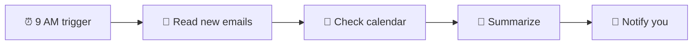

# Daily Morning Briefing

Start every day knowing exactly what needs your attention. HiveMind OS checks your email and calendar each morning, then delivers a clear summary — before you've finished your coffee.

## What You'll Need

| Item | Details |
|------|---------|
| **Email connector** | Gmail, Microsoft 365, or any IMAP account |
| **Calendar connector** | Microsoft 365 or Gmail (optional but recommended) |
| **Time** | About 5 minutes |

---

## Step 1: Connect Your Email

If you've already connected your email (for example, from the [Customer Support](/use-cases/customer-support) use case), you can skip this step.

Otherwise, go to **Settings → Connectors**, click **Add Connector**, and choose your email provider. Follow the prompts to authorize access.

::: tip
For the best briefing experience, connect your calendar too — same process, just select your calendar provider.
:::

## Step 2: Create the Workflow

1. Go to **Workflows** and click **New Workflow**.
2. Name it something like `Morning Briefing`.
3. Set the mode to **Background**.

### Add a Schedule Trigger

4. Click **Add Trigger** and select **Schedule**.
5. Set it to run on **weekdays at 9:00 AM**. In the schedule field, enter the cron expression: `0 9 * * 1-5` (don't worry — the app shows a plain-English preview like "Every weekday at 9:00 AM" so you can confirm it's right).

### Add the Steps

**Step 1 — Read recent emails:**

6. Click **Add Step** and choose **Call Tool**.
7. Select **Read Messages** (under the Communication category).
8. Configure it to fetch emails from the last 24 hours.

**Step 2 — Check today's calendar:**

9. Click **Add Step** and choose **Call Tool**.
10. Select **List Events** (under the Calendar category).
11. Configure it to pull today's events.

**Step 3 — Summarize everything:**

12. Click **Add Step** and choose **Invoke Agent**.
13. You can use the default persona or create a dedicated one (something like "Executive Assistant").
14. In the instructions, type: `Review the emails and calendar events. Create a concise morning briefing organized by priority. Highlight anything urgent.`

**Step 4 — Send the briefing:**

15. Click **Add Step** and choose **Signal Agent**.
16. This delivers the summary as a notification inside HiveMind OS. You'll see it the moment you open the app.

17. Click **Save** and toggle the workflow to **Enabled**.

---

## What You'll See

Every morning, a notification pops up with something like this:

> **☀️ Good Morning — Here's Your Briefing for Tuesday, March 18**
>
> **🔴 Urgent**
> - Email from Acme Corp: Contract renewal deadline is tomorrow. They need a signed copy by 5 PM.
>
> **📨 New Emails (12)**
> - 3 customer inquiries about pricing (forwarded to support)
> - Newsletter from Industry Weekly
> - Invoice from CloudHost Inc. — $247.00 due March 25
> - 8 others (low priority)
>
> **📅 Today's Meetings**
> - 10:00 AM — Team standup (30 min, Google Meet)
> - 1:00 PM — Client call with Acme Corp (45 min, Zoom)
> - 3:30 PM — Marketing review (1 hr, Conference Room B)
>
> **✅ Suggested Priorities**
> 1. Handle the Acme Corp contract before your 1 PM call
> 2. Review the CloudHost invoice
> 3. Prep talking points for the marketing review

---

## Make It Yours

### Change the Schedule

Edit the workflow trigger to adjust the time. Early riser? Set it to 7 AM. Want a weekend edition? Change the cron to include Saturday and Sunday.

### Add Slack or Discord Updates

Connect a **Slack** or **Discord** connector in **Settings → Connectors**. Then add another step to your workflow to post the briefing to a team channel — great for keeping your whole team in the loop.

### Include More Data Sources

HiveMind OS can pull from any connected service. Ideas:
- Connect a **CRM** via MCP to include new leads or deal updates
- Add a web search step to include industry news relevant to your business
- Pull in task updates from project management tools

### Create an End-of-Day Recap

Duplicate the workflow, change the schedule to 5 PM, and adjust the instructions to summarize what happened today and what's carrying over to tomorrow.

---

## Related

- [Customer Support](/use-cases/customer-support) — Auto-reply to customer emails
- [Meeting Prep](/use-cases/meeting-prep) — Get detailed prep briefs for every meeting
- [Connectors Guide](/guides/messaging-bridges) — Set up email, calendar, Slack, and more
- [Scheduling Guide](/guides/scheduling) — Advanced scheduling options and cron expressions
