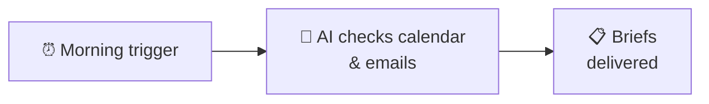

# Automated Meeting Prep

Walk into every meeting prepared — with context on attendees, agenda summaries, and talking points. HiveMind OS scans your calendar and email each morning, then compiles a brief for every meeting on your schedule.

## What You'll Need

| Item | Details |
|------|---------|
| **Calendar connector** | Microsoft 365 or Gmail |
| **Email connector** | Gmail, Microsoft 365, or IMAP (optional but recommended) |
| **Time** | About 10 minutes |

---

## Step 1: Connect Your Calendar

1. Open HiveMind OS and go to **Settings → Connectors**.
2. Click **Add Connector**.
3. Choose your calendar provider — **Microsoft 365** or **Gmail**.
4. Follow the on-screen prompts to sign in and authorize access.
5. You'll see a green checkmark when your calendar is connected.

::: tip
If you've already connected a Microsoft 365 or Gmail account for email, your calendar may already be available — check the connector details to confirm.
:::

## Step 2: Connect Your Email (Optional)

For the best meeting briefs, connect your email too. This lets HiveMind OS search for recent conversations with each meeting's attendees.

If you haven't connected email yet, go to **Settings → Connectors**, click **Add Connector**, and choose your email provider. See the [Customer Support](/use-cases/customer-support) guide for detailed steps.

## Step 3: Create the Workflow

1. Go to **Workflows** and click **New Workflow**.
2. Name it `Meeting Prep`.
3. Set the mode to **Background**.

### Add a Schedule Trigger

4. Click **Add Trigger** and select **Schedule**.
5. Set it to run **weekday mornings** — early enough to give you time to read the briefs before your first meeting. A good default is 7:30 AM on weekdays (cron: `30 7 * * 1-5`). The app shows a plain-English preview so you can confirm.

### Add the Step

6. Click **Add Step** and choose **Invoke Agent**.
7. You can use the default persona or create a dedicated "Meeting Prep" persona. Make sure your calendar and email connectors allow this persona — go to **Settings → Connectors**, edit each connector, and add the persona to its **Allowed Personas** list.
8. In the instructions, type:

> Check my calendar for today's meetings. For each meeting, search my recent emails involving the attendees for relevant context — ongoing projects, open questions, recent decisions. Then compile a preparation brief for each meeting that includes: meeting name and time, attendee list, summary of relevant email context, and 3–5 suggested talking points. Send the compiled briefs to me via email.

9. Click **Save** and toggle the workflow to **Enabled**.

---

## What You'll See

Each morning, you'll get a notification with a brief for every meeting on your calendar:

> **📋 Meeting Brief — Client Call with Acme Corp**
>
> **🕐 Time:** 1:00 PM – 1:45 PM (Zoom)
>
> **👥 Attendees:**
> - Sarah Chen (VP Sales, Acme Corp)
> - Marcus Johnson (Account Manager, your team)
>
> **📨 Recent Context:**
> - Sarah emailed yesterday about concerns with the Q2 delivery timeline
> - Marcus shared an updated project plan on Monday
> - Open question: Acme is evaluating whether to expand the contract to include Phase 3
>
> **💬 Suggested Talking Points:**
> 1. Address Sarah's delivery timeline concerns — reference the updated plan Marcus sent
> 2. Ask about Phase 3 requirements and timeline expectations
> 3. Confirm the next milestone delivery date (currently set for April 10)
> 4. Offer to schedule a technical deep-dive with the engineering team

> **📋 Meeting Brief — Marketing Review**
>
> **🕐 Time:** 3:30 PM – 4:30 PM (Conference Room B)
>
> **👥 Attendees:**
> - Priya Patel, Jordan Lee, Alex Rivera (Marketing team)
>
> **📨 Recent Context:**
> - Last week's campaign report showed a 15% increase in email open rates
> - Jordan flagged that the social media scheduler needs an update
> - New blog post about customer success stories is in draft
>
> **💬 Suggested Talking Points:**
> 1. Celebrate the email open rate improvement — what's driving it?
> 2. Discuss the social media scheduler update — timeline and alternatives
> 3. Review the customer success blog draft — any final edits before publishing?

---

## Make It Yours

### Adjust the Timing

Edit the schedule trigger to match your routine. If your first meeting is always at 10 AM, a 9 AM prep brief gives you plenty of time.

### Focus on External Meetings Only

Refine the instructions to skip internal standups and recurring team syncs — focus prep briefs on client calls and important external meetings where context matters most.

---

## Related

- [Daily Briefing](/use-cases/daily-briefing) — Combine meeting prep with a full morning summary
- [Customer Support](/use-cases/customer-support) — Auto-reply to customer emails
- [Connectors Guide](/guides/messaging-bridges) — Set up calendar, email, Slack, and more
- [Workflows Guide](/guides/workflows) — Learn more about triggers, steps, and the visual designer
